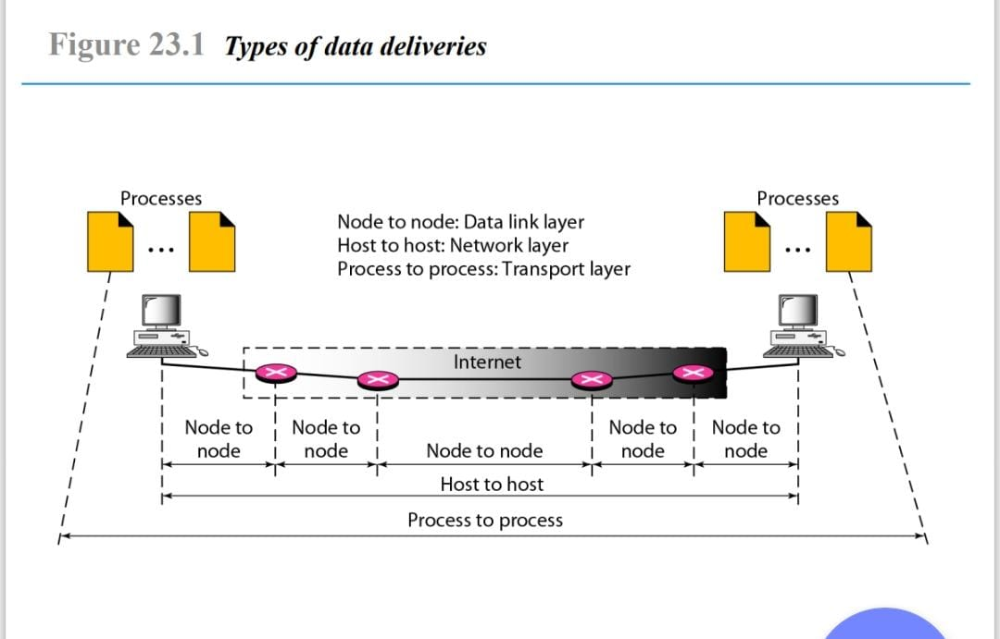

  <h1 style="font-weight: bold"> LAPORAN PRAKTIKUM I WORKSHOP ADMINISTRASI JARINGAN   TCP/ IP </h1>
  <h4 style="text-align: center;">Dosen Pengampu : Dr. Ferry Astika Saputra, S.T., M.Sc.</h4>

 
 

  
  <h3 style="text-align: center;">Disusun Oleh : </h3>
  

    Firsty Angelica Valency (3123500029) 
  

  <h3 style="text-align: center;line-height: 1.5">Program Studi Teknik Informatika Departemen Teknik Informatika Dan Komputer Politeknik Elektronika Negeri Surabaya 2024/2025</h3>
  

# Daftar Isi
- [Daftar Isi](#daftar-isi)
- [Tugas Pendahuluan](#tugas-pendahuluan)
- [Kesimpulan](#kesimpulan)

# Tugas Pendahuluan

1. Analisa file http.cap dengan wireshark : Versi HTTP yang digunakan, IP address dari client maupun server, waktu dari client mengirimkan HTTP request., Waktu dari server mengirimkan server dan berapa durasinya

    [File http.cap](http.cap)

   - Versi HTTP yang digunakan
  
      

       &nbsp;&nbsp; Berdasarkan informasi dari Follow TCP Stream permintaan (request) dan respons (response) HTTP yang diberikan adalah HTTP dengan versi HTTP/1.1. Hal ini membuktikan bahwa baik client maupun server menggunakan `HTTP/1.1`.

   - IP address dari client maupun server
  
      

      

      &nbsp;&nbsp; `IP` addres HTTP `Client` adalah `145.254.160.237`, sedangkan `IP` address HTTP `Server` ialah `65.208.228.223'`

   - Waktu dari client mengirimkan HTTP request.
  
      

      &nbsp;&nbsp; Waktu yang  Client mengirimkan HTTP request terjadi pada detik ke `3,955688s.`

   - Waktu dari server mengirimkan server 

      

     &nbsp;&nbsp; Waktu yang  Client mengirimkan HTTP request terjadi pada detik ke `3,955688s.`

   -  durasi pengiriman untuk menyelesaikan HTTP Response

      

      &nbsp;&nbsp; Untuk mengetahui durasi pengiriman data dari client ke server kita harus mengurasi waktu dari client mengirimkan  HTTP request dengan Waktu dari server mengirimkan server sehingga diperoleh:

      `4,846969 - 3,995688 = 0,891281`

      Jadi, dibutuhkan waktu `0,891281 s` dalam menyelesaikan 1 kali HTTP Response.

    
  2. Deskripsi gambar pada slide 3. 
     
     

   

  &nbsp;&nbsp; Gambar diatas menunjukan proses pengiriman data yang melalui tiga tahapan yaitu: 

   *1. Node to Node (Data Link Layer)*

  &nbsp;&nbsp;&nbsp;&nbsp;&nbsp;&nbsp;Pada tahap ini, `komunikasi` terjadi `antar node secara langsung` menggunakan `protokol` seperti `Ethernet` atau Wi-Fi. Data harus melewati beberapa perangkat network seperti switch dan router (dalam kasus ini adalah router) sebelum data sampai di destination (tujuan pengiriman data) dimana setiap bertemu suatu router disebut node. Data Link layer akan `membagi Data jika melebihi MTU` menjadi bagian-bagian kecil yang disebut `data frame`.
  
  &nbsp;&nbsp;&nbsp;&nbsp;&nbsp;&nbsp; Data Link Layer berperan `mencegah kesalahan pengiriman data` dengan `bit error checking` seperti `Cyclic Redundancy Check (CRC)` dalam setiap data frame (berisi source MAC addres dan Destination MAC address) untuk `mendeteksi` jika ada `kesalahan transmisi`. 

  *2. Host to Host (Network Layer)*

  &nbsp;&nbsp;&nbsp;&nbsp;&nbsp;&nbsp; Host to host adalah pengiriman suatu data komputer (host) ke komputer lain melalui internet. Pada gambar internet terhubung dengan berbagai node. Supaya `data sampai pada tujuan` (komputer lain) `Protokol IP` (Internet Protocol) `menambahkan IP` address pada `source dan destination`. Jika alamat destination ada di luar jaringan lokal, data akan diteruskan ke router (jika komputer ada dalam 1 router maka disebut jaringan lokal).

  *3. Process to Process (Transport Layer)*

  &nbsp;&nbsp;&nbsp;&nbsp;&nbsp;&nbsp; Protokol seperti `TCP/UDP` akan memberi `port number` untuk `mengidentifikasi layanan` yang digunakan. Jika menggunakan `TCP`, data juga diberi `Sequence Number` untuk memastikan urutannya benar meskipun terkirim secara acak.

  # Kesimpulan
   
  &nbsp;&nbsp;&nbsp;&nbsp;&nbsp;&nbsp; Komunikasi menggunakan **TCP (Transmission Control Protocol)** dimulai dengan proses **membangun koneksi**, yang disebut **Three-Way Handshake**. Dalam tahap ini, pengirim terlebih dahulu mengirimkan pesan **SYN (Synchronize)** ke penerima untuk memulai koneksi. Penerima kemudian merespons dengan **SYN-ACK (Synchronize Acknowledge)** sebagai tanda bahwa ia siap menerima data. Terakhir, pengirim mengonfirmasi dengan **ACK (Acknowledge)**, dan koneksi pun terbentuk. Setelah koneksi berhasil dibuat, data mulai dikirim dalam bentuk segmen yang diberi **nomor urut (Sequence Number)** agar tetap tersusun dengan benar. Jika ada data yang hilang atau rusak selama perjalanan, penerima akan meminta pengirim untuk mengirim ulang bagian yang bermasalah.  

   

  &nbsp;&nbsp;&nbsp;&nbsp;&nbsp;&nbsp; Setelah semua data terkirim, koneksi harus ditutup dengan proses yang disebut **Four-Way Handshake**. Dalam tahap ini, pengirim mengirimkan sinyal **FIN (Finish)** untuk memberi tahu penerima bahwa pengiriman data telah selesai. Penerima merespons dengan **ACK**, lalu mengirimkan **FIN** miliknya sendiri untuk menutup koneksi dari sisinya. Pengirim terakhir kali mengonfirmasi dengan **ACK**, dan koneksi pun resmi ditutup. Dengan cara ini, TCP memastikan data dikirim dengan **aman, berurutan, dan tanpa kesalahan**, sehingga sering digunakan dalam berbagai aplikasi penting seperti browsing web, pengiriman email, dan transfer file yang tidak mentolelir kehilangan data.

