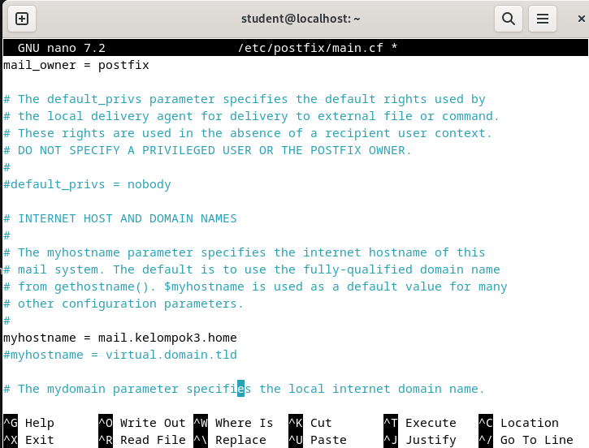
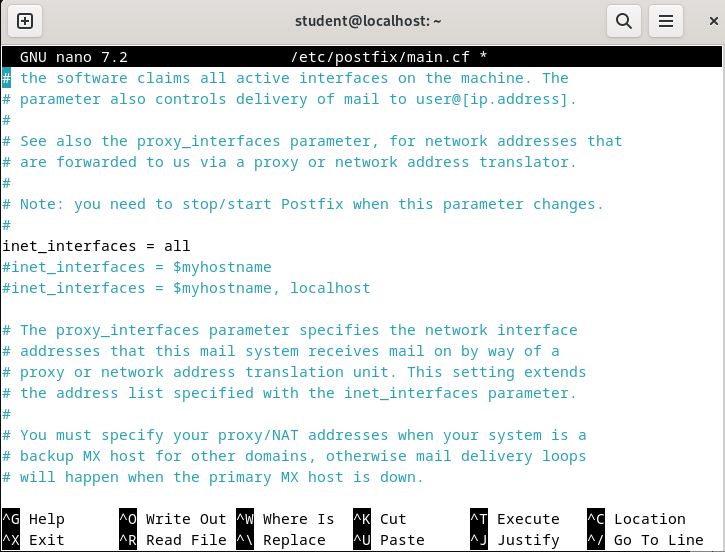

<div align="center">
  <h1 style="font-weight: bold"> LAPORAN PRAKTIKUM WORKSHOP ADMINISTRASI JARINGAN</h1>
   <h1 style="font-weight: bold"> WEB MAIL </h1>
  <h4 style="text-align: center;">Dosen Pengampu : Dr. Ferry Astika Saputra, S.T., M.Sc.</h4>
</div>
<br />
<br />
<div align="center">
  
  <h3 style="text-align: center;">Disusun Oleh : </h3>
  <p style="text-align: center;">
    Firsty Angelica Valency (3123500029)<br>
  </p>
  <h3 style="text-align: center;line-height: 1.5">Program Studi Teknik Informatika<br>Departemen Teknik Informatika Dan Komputer<br>Politeknik Elektronika Negeri Surabaya<br>2024/2025</h3>
  <hr>
</div>

# Daftar Isi
- [Daftar Isi](#daftar-isi)
- [A. Rangkuman Electronic Mail](#a-rangkuman-electronic-mail)
    - [A.1. Apa itu Electronic Mail](#a1-apa-itu-electronic-mail)
    - [A.2. Komponen Sistem Email](#a2-komponen-sistem-email)
    - [A.3. Alur Pengiriman Email dari User A ke User B](#a3-alur-pengiriman-email-dari-user-a-ke-user-b)
    - [A.4. Keuntungan dan Kerugian Email](#a4-keuntungan-dan-kerugian-email)
- [B.Install Postfix](#binstall-postfix)
    - [Konfigurasi SMTP-Auth untuk menggunakan fungsi SASL Dovecot](#konfigurasi-smtp-auth-untuk-menggunakan-fungsi-sasl-dovecot)
- [C. Installasi Devecot](#c-installasi-devecot)
    - [Konfigurasi untuk menyediakan fungsi SASL ke Posfix](#konfigurasi-untuk-menyediakan-fungsi-sasl-ke-posfix)
- [D. Add Mail Server](#d-add-mail-server)
- [Referensi](#referensi)


# A. Rangkuman Electronic Mail
### A.1. Apa itu Electronic Mail

  Surat elektronik (e-mail) adalah metode pertukaran pesan melalui internet. Yang merupakan salah satu layanan Internet yang paling banyak digunakan. Layanan ini memungkinkan pengguna Internet untuk mengirim pesan dalam format (surat) ke pengguna Internet lainnya di bagian mana pun di dunia. Pesan dalam surat tidak hanya berisi teks, tetapi juga berisi gambar, audio, dan data video. Orang yang mengirim surat disebut pengirim dan orang yang menerima surat disebut penerima.

  
  1. **Komponen yang dilibatkan :**
    - Mail Address : Identitas unik untuk setiap pengirim dan penerima, biasanya berupa nama@domain.com
    - Klien Email : program atau software yang digunakan untuk mengirim, menerima dan mengelola email. Contoh : Outlook, Thunderbird, Gmail, Yahoo Mail, Hotmail, dan sebagainya.
    - Server email : Server yang menampung semua surat yang dikirimkan dan diterima oleh pengirim dan penerima tersebut (yang bertanggung jawab untuk menyimpan semua pesan yang dikirimkan).
  
  2. **Langkah-langkah mengirim Email :** <br>
    - Buat Pesan Baru <br>
    - Tambahkan Penerima <br>
    - Tambahkan Subjek <br>
    - Tambahkan Isi <br>
    - Lampirkan Berkas (Opsional) <br>
    - Kirim Email <br>

### A.2. Komponen Sistem Email

  

- **Agen Pengguna (UA):** 
  merupakan program yang digunakan untuk mengirim dan menerima email, sering disebut sebagai pembaca email. UA memiliki kemampuan untuk menerima berbagai perintah seperti menulis, menerima, membalas pesan, serta mengelola kotak surat pengguna.

- **Message Transfer Agent (MTA):**
  MTA berperan sebagai komponen kunci yang bertanggung jawab untuk mentransfer email antar sistem. Untuk proses pengiriman, sistem memerlukan MTA klien dan MTA server. Jika penerima berada dalam sistem yang sama, MTA langsung mengirimkan email ke kotak surat tujuan, namun jika berbeda sistem, MTA akan berkomunikasi dengan MTA lain menggunakan protokol SMTP (Simple Mail Transfer Protocol).

- **Kotak surat:**
  Berfungsi sebagai penyimpanan lokal di hard drive untuk menyimpan semua email yang diterima. Pengguna dapat mengakses, membaca, dan mengelola email dalam kotak surat ini sesuai kebutuhan, dengan akses yang terbatas hanya untuk pemiliknya.

- **File spool:**
   File ini sebagai tempat penyimpanan sementara untuk email yang akan dikirim. UA menambahkan email keluar ke file spool menggunakan SMTP, kemudian MTA akan mengambil dan memproses email tersebut untuk dikirimkan. Sistem email juga mendukung fitur alias dan milis, dimana sebuah nama dapat mewakili beberapa alamat email sekaligus. Ketika pengirim menggunakan alias, sistem akan memeriksa database untuk menentukan apakah alamat tersebut merupakan milis. Jika ya, email akan dikirim ke semua anggota milis; jika tidak, email akan dikirim sebagai pesan tunggal ke alamat yang dimaksud.


- **Layanan Sistem Email:**

  a. Komposisi merupakan layanan pertama yang memungkinkan pembuatan pesan dan balasan, dimana pengguna dapat memanfaatkan berbagai editor teks untuk menyusun konten email. <br />
  b. Transfer berperan sebagai mekanisme pengiriman pesan dari pengirim menuju penerima melalui jaringan email. <br />
  c. Pelaporan memberikan konfirmasi status pengiriman, membantu pengguna melacak apakah email mereka berhasil terkirim, gagal, atau ditolak oleh sistem. <br />
  d. Menampilkan bertanggung jawab menyajikan pesan email dalam format yang mudah dipahami dan diakses oleh pengguna. <br />
  e. Disposisi mengatur tindakan lanjutan setelah email diterima, termasuk opsi untuk menyimpan pesan, menghapus sebelum dibaca, atau menghapus setelah dibaca sesuai kebutuhan penerima.

### A.3. Alur Pengiriman Email dari User A ke User B

 **User A**  ingin mengirim email ke temanmu, **User B** :


1. **Menulis Email (User Agent - UA)**

    User A membuka aplikasi email seperti Gmail atau Outlook dan menulis pesan ke User B.

    **Protokol yang digunakan:**
    **SMTP (Simple Mail Transfer Protocol)** mulai bekerja untuk **mengirimkan email ke sistem server**.

1.  **Penyimpanan Sementara (Spool)**

    Sebelum benar-benar dikirim, email user A disimpan sementara di tempat antrian bernama **spool**.


3. **Pengecekan Alamat (Alias Expander + Database)**

    Sistem memeriksa apakah alamat yang kamu tuju adalah alamat asli, alias (nama samaran), atau grup email. Kalau ternyata itu alias, sistem akan menerjemahkannya ke alamat email asli.

4.  **Pengiriman oleh MTA (Mail Transfer Agent)**

    Setelah itu, **MTA** (semacam “kurir email”) mengambil email dari spool dan **mengirimkannya lewat internet** ke server milik temanmu (User B).

    **Protokol yang digunakan:**
    **SMTP** tetap digunakan di sini, untuk mengantar email antar server.

5.  **Melintasi Internet**

    Email  berjalan melewati internet, menuju server penerima.

6.  **Server Penerima Menerima Email**

    Server temanmu (User B) menerima email melalui MTA-nya. Jika ada alias lagi, akan dicek ulang seperti sebelumnya.


7.  **Masuk ke Kotak Surat (Mailbox)**

    Email akhirnya disimpan di **mailbox** temanmu – seperti kotak pos digital pribadi miliknya.

8.  **User B Membuka Email (User Agent)**

    User B membuka email lewat aplikasi seperti Gmail. Untuk **mengambil email dari mailbox**, ada dua cara:

- **POP3**

    Email **diunduh ke perangkat**, lalu biasanya **dihapus dari server**.
    Cocok untuk pengguna yang hanya pakai **satu perangkat** (misalnya laptop saja).
    Dipakai untuk **mengunduh email ke satu perangkat**.

    Cocok jika:

    * Hanya akses dari satu perangkat.
    * Ingin baca email **offline**.
    * Tidak ingin menyimpan email di server terlalu lama.

-  B. **IMAP**

    Email **tidak diunduh seluruhnya**, tapi **dibaca langsung dari server**.
    Cocok untuk yang mengakses email dari **banyak perangkat** (laptop, HP, tablet).

    Dipakai untuk **mengakses email langsung dari server**, tanpa mengunduh seluruh isi.

    Cocok jika:

    * Sering buka email dari **banyak perangkat**.
    * Ingin email tetap **tersimpan di server**.
    * Butuh **sinkronisasi otomatis**.

- **Tabel Perbandingan**

  | Fitur        | POP3                       | IMAP                              |
  | ------------ | -------------------------- | --------------------------------- |
  | Akses dari   | 1 perangkat                | Banyak perangkat                  |
  | Penyimpanan  | Di perangkat               | Di server                         |
  | Sinkronisasi | Tidak                      | Ya                                |
  | Baca offline | Ya                         | Terbatas                          |
  | Cocok untuk  | Email pribadi, hemat kuota | Profesional, sinkron multi-device |


### A.4. Keuntungan dan Kerugian Email

- **Keuntungan Email:**

Komunikasi yang mudah dan cepat dengan individu maupun kelompok di seluruh dunia
Menyediakan kemudahan dalam menyimpan dan mencari kembali pesan-pesan lama
Memiliki kemampuan untuk mengirim dan menerima berbagai lampiran seperti dokumen, gambar, dan video
Lebih hemat biaya dibandingkan metode pengiriman tradisional seperti surat pos atau faksimili
Tersedia dan dapat diakses 24 jam sehari, 7 hari seminggu tanpa batasan waktu

- **Kerugian Email:**

Rentan terhadap serangan spam dan phishing yang membahayakan keamanan data
Banyaknya jumlah email yang diterima dapat menyebabkan overload informasi
Berpotensi mengurangi intensitas komunikasi tatap muka dan kehilangan sentuhan pribadi
Memiliki risiko miskomunikasi karena tidak adanya penekanan nada dan bahasa tubuh dalam pesan tertulis
Dapat mengalami gangguan teknis seperti masalah server yang mengakibatkan layanan tidak berjalan optimal


# B.Install Postfix
  
Instal Postfix digunakan untuk mengonfigurasi Server SMTP

 ### Konfigurasi SMTP-Auth untuk menggunakan fungsi SASL Dovecot

1. Instalasi Paket Postfix dan sasl2-bin
  
    

2. Salin file konfigurasi default Postfix ke lokasi konfigurasi utama
  
    

3. Edit file `/etc/postfix/main.cf`
    
    Uncomment mail_owner
   
    

    Lakukan uncomment pada parameter hostname dan isikan sesuai dengan hostname yang telah dikonfigurasi di awal praktikum untuk masing-masing kelompok

    

    

    Lakukan uncomment pada parameter domain dan isikan sesuai dengan domain yang telah dikonfigurasi di awal praktikum untuk masing-masing kelompok

    

    Uncomment myorigin

    

    Uncomment inet_interfaces

    

    Uncomment mydestination

    

    Uncomment local_recipient_maps

    

    Uncomment mynetworks_style

    

    Tambahkan jaringan lokal yang terhubung dengan PC/server

    

    Uncomment alias_maps

    

    Uncomment alias_database

    

    Uncomment home_mailbox

    

    Comment baris `smtpd_banner` default Debian, kemudian tambahkan baris smtpd_banner baru yang tidak menggunakan variabel `$email_name`

    

    Tambahkan konfigurasi path untuk sendmail `(sendmail_path)`, newaliases `(newaliases_path)`, dan mailq `(mailq_path)`, serta definisikan sebuah group baru `(setgid_group)` dalam file konfigurasi

    

    Comment out semua direktori yang tidak digunakan (`html_directory`, `manpage_directory`, `sample_directory`, dan `readme_directory`). Selain itu, ubah protokol inet dari IPv6 menjadi IPV4.

    

    Disable SMTP VRFY command, required HELO command, atur message size limit, dan tambahkan SMTP Auth Settings

    

    Jalankan perintah newaliases dan lakukan restart postfix

    

    Konfigurasi ini digunakan untuk menolak spam emails, namun perlu diterapkan dengan hati-hati karena berpotensi juga menolak email legitimate (non-spam) apabila terdapat ketidaksesuaian dalam konfigurasi.

    


# C. Installasi Devecot

Install Devecot untuk mengonfigurasi server POP/IMAP

### Konfigurasi untuk menyediakan fungsi SASL ke Posfix

1. Install Devecot
  
    
  
2. Konfigurasi file `/etc/dovecot/dovecot.conf`, dan lakukan uncomment pada baris ke 30
   
    

3. Konfigurasi file `/etc/dovecot/conf.d/10-auth.conf`, dan lakukan uncomment pada baris ke 10 & 100 dan ubah allow plain text auth
   
    

    
    
4. Konfigurasi file `/etc/dovecot/conf.d/10-mail.conf`, dan ubah mail location ke Maildir
    
    
  
5. Konfigurasi file `/etc/dovecot/conf.d/10-master.conf`, uncomment pada baris ke 107-109 dan tambahkan seperti dibawah ini
  
    

6. Lakukan restart dovecot

    

# D. Add Mail Server

Tambahkan akun pengguna mail untuk menggunakan mail server

1.  Instalasi mail client
  
    

2. Atur environment variable untuk maildir
   
    

3. Tambahkan OS user baru

  ```bash
    add user student2
  ```

4. Mencoba untuk mengirim email ke user baru
   
    

5. Login sebagai user student2 dan masukkan password
   
   ```bash
    su- student2
   ```

6. Cek `email` yang dikirim dari user student dengan perintah `mail`

    

Dapat dilihat email sudah berhasil terkirim dan diterima

# Referensi

- [Introduction to Electronic Mail](https://www.geeksforgeeks.org/introduction-to-electronic-mail/)

- [Mail Server Configuration](https://www.server-world.info/en/note?os=Debian_12&p=mail&f=1)


    
