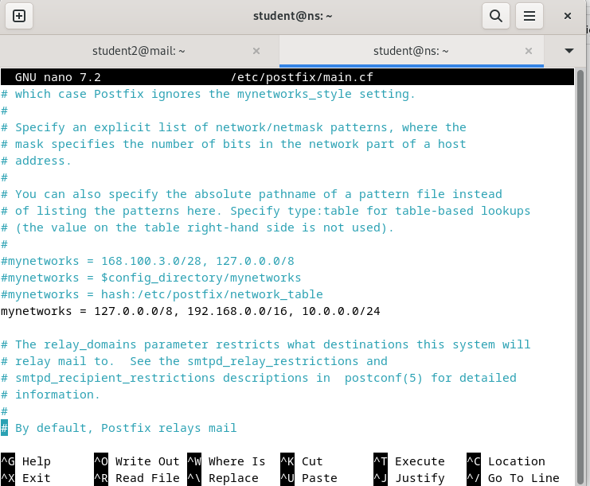
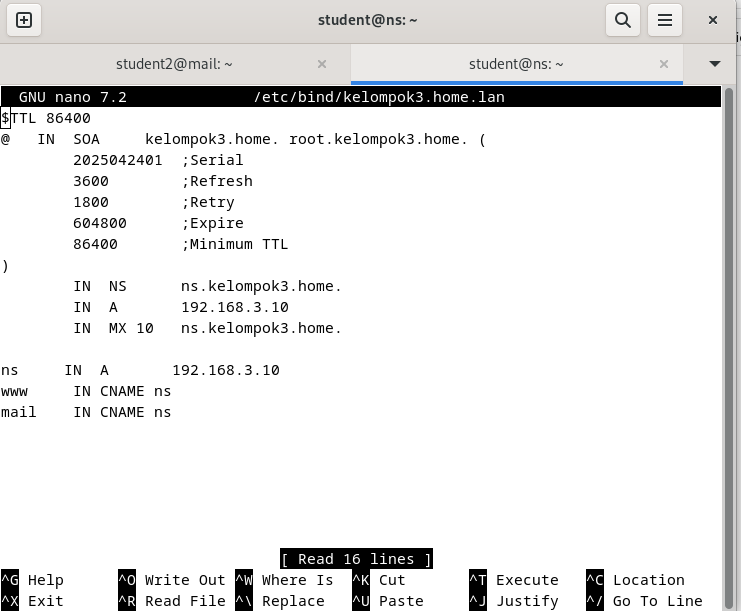
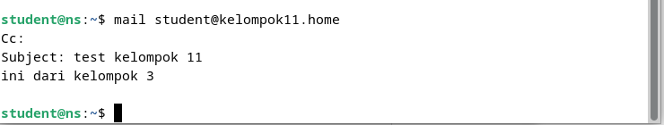
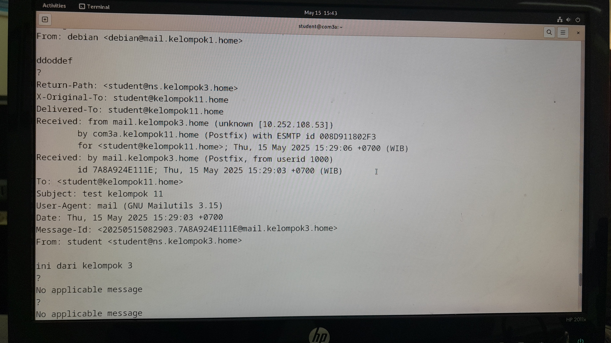
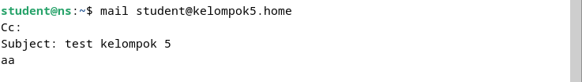
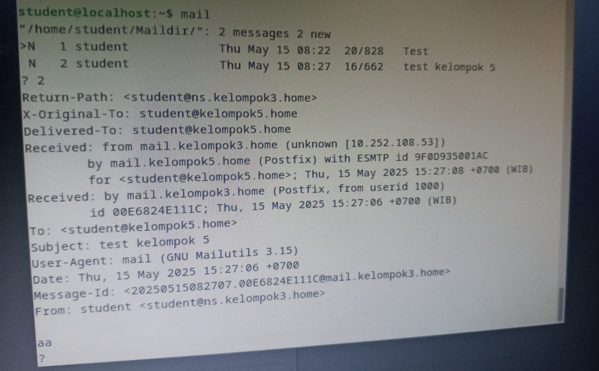

  <h1 style="font-weight: bold"> LAPORAN PRAKTIKUM WORKSHOP ADMINISTRASI JARINGAN</h1>
   <h1 style="font-weight: bold"> SEND WEB MAIL </h1>
  <h4 style="text-align: center;">Dosen Pengampu : Dr. Ferry Astika Saputra, S.T., M.Sc.</h4>

 
 

  
  <h3 style="text-align: center;">Disusun Oleh : </h3>
  

    Firsty Angelica Valency (3123500029) 
  

  <h3 style="text-align: center;line-height: 1.5">Program Studi Teknik Informatika Departemen Teknik Informatika Dan Komputer Politeknik Elektronika Negeri Surabaya 2024/2025</h3>
  

# Daftar Isi
- [Daftar Isi](#daftar-isi)
- [A. Pendahuluan](#a-pendahuluan)
- [B. Penamaan Hostname Mail](#b-penamaan-hostname-mail)
- [C. Percobaan Pengiriman Email ke domain Eksternal](#c-percobaan-pengiriman-email-ke-domain-eksternal)
- [Referensi](#referensi)

# A. Pendahuluan

Laporan praktikum mail server ini merupakan percobaan pengiriman email antar domain eksternal menggunakan terminal dan aplikasi GNOME Evolution, yang berfungsi sebagai Personal Information Manager dengan fitur email terintegrasi.

Konfigurasi Network Pada Postfix
Pada konfigurasi Postfix, terdapat parameter mynetworks yang berfungsi untuk menentukan jaringan atau alamat IP mana saja yang diperbolehkan menggunakan mail server untuk mengirim email.

Dalam praktikum ini, parameter mynetworks pada file main.cf diubah dan disesuaikan dengan alamat IP yang telah ditentukan, yaitu:

- `127.0.0.0/8` yang merepresentasikan localhost atau loopback address

- `192.168.0.0/16` yang merupakan jaringan private kelas C

- `10.0.0.0/8` yang merupakan jaringan private kelas A.

Ketiga alamat IP tersebut digunakan agar mail server dapat menerima koneksi dari jaringan lokal sesuai dengan topologi dan kebutuhan praktikum yang dilakukan.

# B. Penamaan Hostname Mail

Untuk memastikan koneksi antar domain lain dapat berjalan dengan baik serta proses pengiriman dan penerimaan email dapat dilakukan tanpa kendala, maka perlu dilakukan penambahan hostname mail pada konfigurasi DNS di masing-masing kelompok. Hostname mail tersebut berfungsi sebagai penanda atau alias yang merujuk langsung ke alamat IP dari server email (mail server). Dengan adanya entri ini pada DNS, setiap kelompok dapat saling mengenali dan berkomunikasi melalui server email masing-masing secara efektif.

**Note** : *Gambar tersebut terdapat kesalahan yakni hostname mail belum ditambahkan pada saat pengambilan tangkapan layar (capture). Namun, sebenarnya penambahan hostname mail telah dilakukan dalam konfigurasi DNS.*

Berdasarkan gambar file konfigurasi zona DNS (`/etc/bind/kelompok3.home.lan`), berikut adalah penjelasan mengenai istilah-istilah penting yang terdapat dalam konfigurasi tersebut:

- `IN (Internet)` merupakan singkatan dari Internet dan digunakan untuk menunjukkan kelas dari record DNS.

- `SOA (Start of Authority)` adalah record pertama dan paling penting dalam sebuah file zona DNS. Record ini menyatakan bahwa zona DNS tersebut diotorisasi oleh domain yang bersangkutan, serta memuat informasi administratif terkait zona tersebut.

- `Refresh`, `Retry`, `Expire`, dan `Minimum TTL` adalah parameter untuk pengelolaan replikasi DNS antar server.

# C. Percobaan Pengiriman Email ke domain Eksternal

Gambar di bawah ini menunjukkan hasil dari percobaan pengiriman email menggunakan terminal. Dalam percobaan ini, email dikirimkan ke alamat milik kelompok 11 yang berperan sebagai master DNS. 

Bukti bahwa email berhasil terkirim ditunjukkan pada gambar di bawah ini, di mana email tersebut berhasil diterima dan dapat dibuka oleh PC milik kelompok 11. Hal ini menandakan bahwa proses pengiriman dan penerimaan email antar kelompok (domain eksternal) telah berjalan dengan baik.

Pada percobaan kedua, dilakukan pengiriman email menuju kelompok 5. Proses pengiriman dilakukan dengan menggunakan terminal, sebagaimana pada percobaan sebelumnya.

Hasil dari percobaan menunjukkan bahwa email berhasil terkirim dan diterima oleh kelompok 5. Hal ini menjadi bukti bahwa konfigurasi mail server telah berjalan dengan baik, dan sistem pengiriman email antar kelompok (domain eksternal) pada praktikum ini telah berhasil.

# Referensi 

- [Mail Server Configuration](https://www.server-world.info/en/note?os=Debian_12&p=mail&f=4)