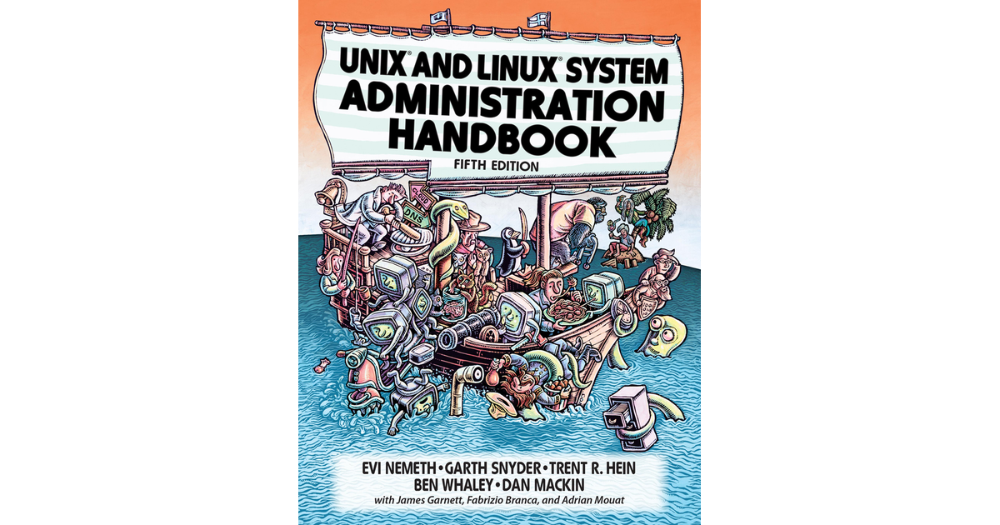

<div align="center">
  <h1 style="font-weight: bold"> Unix-and-Linux-sysadmin-notes <br> Rangkuman Chapter 4: Process Control</h1>
</div>
<br />
<br />
<div align="center">
  
</div>
<br />
<br />
<div align="center">
  <p style="line-height: 1.5"> Unix and Linux system administration handbook by Evi Nemeth Garth Snyder Trent R. Hein Ben Whaley Dan Mackin</h3>
  <p>
</div>

---


# Daftar Isi
- [Daftar Isi](#daftar-isi)
  - [Chapter 4: Process Control](#chapter-4-process-control)
    - [A. Components of a Process](#a-components-of-a-process)
    - [B. The PID: process ID number](#b-the-pid-process-id-number)
    - [C. The PPID: parent process ID number](#c-the-ppid-parent-process-id-number)
    - [D. The UID and EUID: user ID and effective user ID](#d-the-uid-and-euid-user-id-and-effective-user-id)
    - [D. Lifecycle of a Process](#d-lifecycle-of-a-process)
    - [E. Signals](#e-signals)
    - [F. kill: send signals](#f-kill-send-signals)
      - [F.1 Menghentikan Proses dengan `kill`](#f1-menghentikan-proses-dengan-kill)
      - [F.2 Menghentikan Proses Berdasarkan Nama](#f2-menghentikan-proses-berdasarkan-nama)
      - [F.3 Memantau Proses dengan `ps`](#f3-memantau-proses-dengan-ps)
      - [F.4 Menampilkan Semua Proses yang Berjalan](#f4-menampilkan-semua-proses-yang-berjalan)
      - [F.5 Mencari Proses Tertentu](#f5-mencari-proses-tertentu)
    - [G. Monitoring Interaktif dengan top](#g-monitoring-interaktif-dengan-top)
    - [H. Nice dan Renice: Mengubah Prioritas Proses](#h-nice-dan-renice-mengubah-prioritas-proses)
      - [H. 1 Menggunakan nice](#h-1-menggunakan-nice)
      - [H.2 Menggunakan renice](#h2-menggunakan-renice)
      - [H.3 Hubungan antara nice value dan priority](#h3-hubungan-antara-nice-value-dan-priority)
    - [I. Sistem File /proc](#i-sistem-file-proc)
    - [J. Strace dan Truss](#j-strace-dan-truss)
    - [K. Proses Runaway (Tidak Terkendali)](#k-proses-runaway-tidak-terkendali)
    - [L. Proses Berkala (Periodic Processes)](#l-proses-berkala-periodic-processes)
      - [L.1 cron: Menjadwalkan Perintah](#l1-cron-menjadwalkan-perintah)
      - [L.2 Format Crontab](#l2-format-crontab)
      - [Contoh Penggunaan](#contoh-penggunaan)
      - [F.3 Manajemen Crontab](#f3-manajemen-crontab)
    - [G. Systemd Timer: Alternatif untuk Cron Job](#g-systemd-timer-alternatif-untuk-cron-job)
      - [G.1 Melihat Timer yang Aktif](#g1-melihat-timer-yang-aktif)
      - [G.2 Contoh Konfigurasi Systemd Timer](#g2-contoh-konfigurasi-systemd-timer)
      - [G.3 Penggunaan Umum Systemd Timer \& Cron Job](#g3-penggunaan-umum-systemd-timer--cron-job)
      - [G.3.1. Mengirim Email Otomatis](#g31-mengirim-email-otomatis)
      - [G.3.2. Membersihkan File Sampah Secara Otomatis](#g32-membersihkan-file-sampah-secara-otomatis)
      - [G.3.3. Rotasi File Log](#g33-rotasi-file-log)
      - [G.4.4. Menjalankan Batch Job](#g44-menjalankan-batch-job)
      - [G.5.5. Backup dan Sinkronisasi Data](#g55-backup-dan-sinkronisasi-data)

--- 
## Chapter 4: Process Control

### A. Components of a Process  

&nbsp;&nbsp;&nbsp;&nbsp;  Sebuah `proses terdiri dari ruang alamat dan beberapa struktur data` yang `dikelola oleh sistem operasi (kernel)`. `Ruang alamat` adalah` bagian memori yang disediakan oleh sistem untuk proses` tersebut. `Memori ini terbagi dalam unit yang disebut halaman (pages), biasanya berukuran 4KiB atau 8KiB`. Halaman ini digunakan untuk menyimpan kode program, data, dan stack proses.  

&nbsp;&nbsp;&nbsp;&nbsp;Selain itu, sistem operasi juga menyimpan berbagai informasi tentang proses, seperti statusnya, prioritas, dan sumber daya yang digunakan. Secara sederhana, proses bisa dianggap sebagai wadah yang berisi semua hal yang diperlukan oleh sebuah program agar bisa berjalan, seperti memori, file yang dibuka, dan atribut lainnya.  

&nbsp;&nbsp;&nbsp;&nbsp;Beberapa informasi yang dicatat oleh sistem operasi untuk setiap proses meliputi:  

`Peta ruang alamat proses`
  - Status proses saat ini (running, sleeping, and so on)
  - Prioritas proses
  - Informasi tentang sumber daya yang digunakan proses (CPU, memori, dan sebagainya)
  - Informasi tentang file dan port jaringan yang telah dibuka oleh proses
  - The process's signal mask (sekumpulan sinyal yang saat ini diblokir)
  - The owner of the process (ID USER yang memulai proses)

&nbsp;&nbsp;&nbsp;&nbsp; Di dalam sebuah proses, terdapat yang disebut `thread`, yaitu `bagian dari proses yang menjalankan tugas tertentu`. Sebuah proses bisa memiliki beberapa thread yang bekerja secara bersamaan dan berbagi sumber daya yang sama. Karena `thread lebih ringan dibandingkan proses`, pembuatannya lebih cepat dan tidak memerlukan banyak sumber daya.  

&nbsp;&nbsp;&nbsp;&nbsp; Sebagai contoh, bayangkan sebuah `server web yang menangani banyak permintaan dari user`.  `Server ini akan membuat thread baru untuk setiap permintaan yang masuk`. Dengan cara ini, `server dapat melayani banyak pengguna sekaligus tanpa harus membuat proses baru untuk setiap permintaan`. Dalam kasus ini, `server web` adalah `proses utama`, sementara `setiap permintaan diproses oleh thread yang bekerja secara bersamaan`.

### B. The PID: process ID number

&nbsp;&nbsp;&nbsp;&nbsp; Setiap proses di dalam sistem operasi memiliki nomor unik yang disebut `Process ID (PID)`. PID ini diberikan oleh sistem saat proses dibuat dan digunakan untuk mengidentifikasi serta mengelola proses tersebut.  

&nbsp;&nbsp;&nbsp;&nbsp; &nbsp;&nbsp;&nbsp;&nbsp;PID sangat penting karena memungkinkan sistem untuk mengenali proses tertentu, misalnya saat kita ingin menghentikan atau mengirim perintah ke sebuah proses. Dalam dunia komputasi modern, ada konsep yang disebut `namespace` yang sering digunakan dalam container. Tujuannya adalah mengelola `beberapa proses dengan PID yang sama agar tetap berjalan di lingkungan yang terpisah tanpa saling mengganggu`.

### C. The PPID: parent process ID number

&nbsp;&nbsp;&nbsp;&nbsp; Setiap proses juga memiliki `ID` yang disebut `Parent Process ID (PPID)`. PPID ini digunakan oleh sistem operasi untuk mengidentifikasi proses induknya. PPID ini berguna untuk mengetahui bagaimana proses induknya berinteraksi dengan proses lain.

&nbsp;&nbsp;&nbsp;&nbsp; `PPID` digunakan oleh sistem untuk `menghubungkan sebuah proses dengan proses induknya`. Misalnya, saat sebuah proses baru dibuat oleh program tertentu, proses tersebut akan memiliki PPID yang merujuk pada program pembuatnya. PPID juga berguna dalam berbagai operasi sistem, seperti saat proses anak perlu berkomunikasi atau mengirim sinyal ke proses induknya.

### D. The UID and EUID: user ID and effective user ID

 &nbsp;&nbsp;&nbsp;&nbsp; `User ID (UID)` dan `Effective User ID (EUID)` adalah `informasi yang digunakan oleh sistem operasi untuk mengidentifikasi user yang berbeda`.


 &nbsp;&nbsp;&nbsp;&nbsp; `EUID` berperan penting dalam `mengatur izin akses`. Misalnya, jika sebuah program dijalankan dengan `hak administrator`, `EUID`-nya bisa `berbeda dari UID penggunanya`, sehingga `proses tersebut dapat mengakses lebih banyak sumber daya daripada yang biasanya diperbolehkan`.

 &nbsp;&nbsp;&nbsp;&nbsp; `UID` digunakan oleh sistem operasi untuk `mengidentifikasi user yang berbeda`. Misalnya, jika sebuah program dijalankan dengan `hak administrator`, `UID-nya` bisa `berbeda dari UID penggunanya`, sehingga `proses tersebut dapat mengakses lebih banyak sumber daya daripada yang biasanya diperbolehkan`.

### D. Lifecycle of a Process

&nbsp;&nbsp;&nbsp;&nbsp; `Siklus Hidup Proses(Lifecycle of a Process) dimulai` ketika sebuah `proses baru dibuat` menggunakan `perintah fork`. Perintah ini `menyalin proses yang sudah ada`, sehingga `proses baru memiliki karakteristik yang hampir sama dengan proses induknya`. Namun, `proses baru` memiliki `PID yang berbeda` dan informasi akunting sendiri.  

&nbsp;&nbsp;&nbsp;&nbsp; Pada sistem Linux, sebenarnya digunakan `perintah clone`  , yang merupakan `versi lebih canggih dari fork` dan mendukung pembuatan thread serta fitur tambahan lainnya. `fork tetap ada untuk kompatibilitas, tetapi di dalam sistem, ia memanggil clone`.  

&nbsp;&nbsp;&nbsp;&nbsp; Saat `komputer dinyalakan`, sistem operasi otomatis membuat beberapa `proses penting`. Salah satunya adalah `init atau systemd`, yang selalu memiliki `PID 1`. Proses ini `bertanggung jawab menjalankan skrip startup sistem dan menjadi induk bagi semua proses lain`, `kecuali yang langsung dibuat oleh kernel`.

### E. Signals

&nbsp;&nbsp;&nbsp;&nbsp; `Sinyal (Signals)` adalah `cara sistem` untuk `memberi tahu suatu proses bahwa sebuah peristiwa telah terjadi`. Sinyal digunakan untuk berbagai keperluan, mulai dari `komunikasi antarproses hingga menangani kesalahan dalam program`.  

&nbsp;&nbsp;&nbsp;&nbsp; Terdapat sekitar `30 jenis sinyal yang memiliki fungsi berbeda-beda`, seperti:  

- Digunakan untuk komunikasi antarproses.  
- Dikirim oleh terminal ketika pengguna menekan tombol seperti `<Control-C>` atau `<Control-Z>` untuk menghentikan atau menjeda proses.  
- Dikirim oleh administrator menggunakan perintah `kill` untuk mengakhiri proses tertentu.  
- Dikirim oleh kernel jika terjadi kesalahan, seperti pembagian dengan nol.  
- Dikirim oleh kernel untuk memberi tahu proses tentang kejadian penting, misalnya ketika sebuah proses anak berhenti atau ada data yang siap diproses dalam saluran I/O.

    

&nbsp;&nbsp;&nbsp;&nbsp; Beberapa sinyal dalam sistem operasi mungkin terdengar mirip, tetapi sebenarnya memiliki fungsi yang berbeda. Berikut beberapa sinyal yang sering digunakan:  

- **KILL** → Sinyal ini tidak bisa diblokir dan langsung menghentikan proses di tingkat kernel. Proses tidak dapat menangkap atau menangani sinyal ini.  
- **INT** → Dikirim oleh terminal ketika pengguna menekan `<Control-C>`, meminta proses untuk berhenti. Program sederhana biasanya langsung keluar, sedangkan program interaktif seperti shell hanya menghentikan operasi dan menunggu perintah selanjutnya.  
- **TERM** → Meminta proses untuk berhenti sepenuhnya. Proses yang menerimanya diharapkan dapat membersihkan sumber daya sebelum keluar.  
- **HUP** → Dikirim ketika terminal tempat proses berjalan ditutup. Awalnya digunakan untuk menandakan putusnya sambungan telepon, tetapi sekarang sering digunakan untuk meminta daemon agar restart dan memuat ulang konfigurasi baru.  
- **QUIT** → Mirip dengan TERM, tetapi jika tidak ditangkap, proses akan menghasilkan core dump (file yang berisi informasi debugging). Beberapa program menggunakan sinyal ini untuk fungsi tertentu.

### F. kill: send signals

Menghentikan dan Memantau Proses di Sistem Operasi Linux  

#### F.1 Menghentikan Proses dengan `kill`  
&nbsp;&nbsp;&nbsp;&nbsp; Perintah **`kill`** digunakan untuk menghentikan proses yang sedang berjalan. Perintah ini bisa mengirim berbagai jenis sinyal ke suatu proses, tetapi secara default akan mengirim sinyal **TERM (terminate)**.  

Format dasar penggunaan:  
```bash
kill [-signal] pid
```
- `signal` → Nomor atau nama sinyal yang dikirimkan.  
- `pid` → ID proses yang ingin dihentikan.  

&nbsp;&nbsp;&nbsp;&nbsp; Jika `kill` dijalankan tanpa menyertakan nomor sinyal, proses tidak selalu langsung berhenti karena sinyal `TERM` bisa ditolak atau diabaikan oleh proses tersebut. Namun, jika menggunakan `kill -9 pid`, proses akan langsung dihentikan karena sinyal `KILL` tidak bisa diabaikan atau diblokir.  

#### F.2 Menghentikan Proses Berdasarkan Nama  
- `killall` → Digunakan untuk menghentikan semua proses berdasarkan nama. Tidak tersedia di semua sistem.  
  ```bash
  killall firefox
  ```
- **`pkill`** → Mirip dengan `killall`, tetapi memiliki lebih banyak opsi. Contohnya:  
  ```bash
  pkill -u angel  # Menghentikan semua proses milik user "angel"
  ```

---

#### F.3 Memantau Proses dengan `ps` 
&nbsp;&nbsp;&nbsp;&nbsp; Perintah `ps` digunakan untuk melihat daftar proses yang sedang berjalan di sistem. Informasi yang ditampilkan meliputi **PID (Process ID), UID (User ID), penggunaan memori dan CPU, serta status proses.  

#### F.4 Menampilkan Semua Proses yang Berjalan  
&nbsp;&nbsp;&nbsp;&nbsp; Gunakan perintah berikut untuk melihat semua proses yang berjalan di sistem dengan detail:  
```bash
ps aux
```
- **`a`** → Menampilkan proses dari semua pengguna.  
- **`u`** → Menampilkan detail tambahan.  
- **`x`** → Menampilkan proses yang tidak terkait dengan terminal.  

Contoh output:  
```bash
USER       PID %CPU %MEM    VSZ   RSS TTY      STAT START   TIME COMMAND
root         1  0.0  0.0  22556  2584 ?        Ss   2019   0:02 /sbin/init
root         2  0.0  0.0      0     0 ?        S    2019   0:00 [kthreadd]
root         9  0.0  0.0      0     0 ?        S    2019   0:00 [ksoftirqd/0]
```

&nbsp;&nbsp;&nbsp;&nbsp; Jika ingin melihat informasi lebih teknis dengan lebih cepat, gunakan:  
```bash
ps lax
```
&nbsp;&nbsp;&nbsp;&nbsp; Perintah ini mirip dengan `ps aux`, tetapi tidak menampilkan nama pengguna dan grup sehingga lebih ringan dijalankan.

---

#### F.5 Mencari Proses Tertentu  
&nbsp;&nbsp;&nbsp;&nbsp;Untuk mencari proses tertentu yang sedang berjalan, bisa menggunakan kombinasi dengan `grep`:  
```bash
ps aux | grep -v grep | grep firefox
```
&nbsp;&nbsp;&nbsp;&nbsp; Perintah di atas mencari semua proses yang berhubungan dengan `Firefox`, kecuali proses `grep` itu sendiri.

&nbsp;&nbsp;&nbsp;&nbsp; Selain itu, bisa juga menggunakan `pgrep` untuk mencari `PID` suatu proses:  
```bash
pgrep firefox
```
&nbsp;&nbsp;&nbsp;&nbsp; Atau dengan `pidof` untuk mengetahui `PID` dari jalur eksekusi aplikasi:  
```bash
pidof /usr/bin/firefox
```

### G. Monitoring Interaktif dengan top  

&nbsp;&nbsp;&nbsp;&nbsp; Perintah `top`  `memberikan tampilan real-time` yang dinamis tentang `sistem yang sedang berjalan`.  top  menampilkan `ringkasan informasi sistem serta daftar proses atau thread yang sedang dikelola oleh kernel Linux`.  

&nbsp;&nbsp;&nbsp;&nbsp; Tampilan  `top  diperbarui setiap 1-2 detik secara default`, tergantung pada sistem.  

&nbsp;&nbsp;&nbsp;&nbsp; Selain  `top` , ada juga  `htop`  , yang merupakan `penampil proses interaktif untuk sistem Unix`.  `htop`   memiliki `interface yang lebih baik` dan mendukung `navigasi vertikal maupun horizontal untuk melihat semua proses yang berjalan`. Perintah ini juga memungkinkan pengguna untuk melakukan operasi tambahan dengan lebih mudah.  

---

### H. Nice dan Renice: Mengubah Prioritas Proses  

&nbsp;&nbsp;&nbsp;&nbsp; `Niceness` adalah `petunjuk numerik` kepada `kernel` tentang bagaimana suatu `proses harus diperlakukan dibandingkan dengan proses lain yang menggunakan CPU`.  

- Nilai `niceness` yang `tinggi` berarti `prioritas rendah` (proses akan mendapat lebih sedikit waktu CPU).  
- Nilai `niceness` yang `rendah atau negatif` berarti `prioritas tinggi` (proses akan mendapat lebih banyak waktu CPU).  

`Range nilai niceness` berbeda pada setiap sistem:
- `Linux`: -20 hingga +19  
- `FreeBSD`: -20 hingga +20  

&nbsp;&nbsp;&nbsp;&nbsp; Jika menjalankan proses yang `memerlukan banyak CPU di background`, dapat `memberinya nilai niceness tinggi` agar proses lain tetap berjalan lancar. 

#### H. 1 Menggunakan nice  
&nbsp;&nbsp;&nbsp;&nbsp; Untuk memulai proses dengan nilai `niceness` tertentu:  
```bash
nice -n nilai_nice [perintah]
# Contoh
nice -n 10 sh infinite.sh &
```

#### H.2 Menggunakan renice  
&nbsp;&nbsp;&nbsp;&nbsp; Untuk mengubah nilai `niceness` dari proses yang sudah berjalan:  
```bash
renice -n nilai_nice -p pid
# Contoh
renice -n 10 -p 1234
```

#### H.3 Hubungan antara nice value dan priority  
&nbsp;&nbsp;&nbsp;&nbsp; Di Linux, prioritas proses dihitung dengan rumus:  
> **priority_value = 20 + nice_value**  

Secara default, `nice_value` adalah 0. Semakin rendah nilai `nice_value`, semakin tinggi prioritas proses tersebut.  

---

### I. Sistem File /proc

&nbsp;&nbsp;&nbsp;&nbsp; Perintah `ps` dan `top` di Linux mendapatkan informasi status proses dari direktori `/proc`. `/proc` adalah pseudo-filesystem yang memungkinkan kernel mengekspos berbagai informasi tentang keadaan sistem.  

&nbsp;&nbsp;&nbsp;&nbsp; Setiap proses di Linux direpresentasikan dalam `/proc` sebagai sebuah direktori dengan nama sesuai PID-nya. Direktori ini berisi berbagai file yang memberikan informasi tentang proses, seperti:  
  - `Command line` yang digunakan untuk menjalankan proses  
  - `Variabel lingkungan`  
  - `File descriptor` yang terbuka  

&nbsp;&nbsp;&nbsp;&nbsp; Selain informasi tentang proses, `/proc` juga menyimpan statistik dan berbagai data sistem lainnya.


Berikut adalah penjelasan dalam bahasa Indonesia:

---

### J. Strace dan Truss  

Untuk mengetahui apa yang sedang dilakukan suatu proses, Anda bisa menggunakan  `strace di Linux`  atau  `truss di FreeBSD`. Perintah ini digunakan untuk `melacak panggilan sistem (system calls) dan sinyal (signals) yang terjadi dalam suatu proses`. Dengan alat ini, Anda bisa melakukan debugging atau memahami bagaimana suatu program bekerja.

Sebagai contoh, berikut adalah log yang dihasilkan oleh `strace` ketika `dijalankan pada proses top` dengan `PID 5810`:

```bash
$ strace -p 5810

gettimeofday({1197646605,  123456}, {300, 0}) = 0
open("/proc", O_RDONLY|O_NONBLOCK|O_LARGEFILE|O_DIRECTORY) = 7
fstat64(7, {st_mode=S_IFDIR|0555, st_size=0, ...}) = 0
fcntl64(7, F_SETFD, FD_CLOEXEC)          = 0
getdents64(7, /* 3 entries */, 32768)   = 72
getdents64(7, /* 0 entries */, 32768)   = 0
stat64("/proc/1", {st_mode=S_IFDIR|0555, st_size=0, ...}) = 0
open("/proc/1/stat", O_RDONLY)           = 8
read(8, "1 (init) S 0 1 1 0 -1 4202752"..., 1023) = 168
close(8)                                = 0
```

&nbsp;&nbsp;&nbsp;&nbsp; Dari log ini terlihat bahwa `top` pertama-tama memeriksa waktu saat ini, lalu membuka dan membaca direktori `/proc`. Selanjutnya, program mengakses file  `/proc/1/stat` untuk mendapatkan informasi tentang proses `init`.

---

### K. Proses Runaway (Tidak Terkendali)

&nbsp;&nbsp;&nbsp;&nbsp; Terkadang, suatu `proses bisa berhenti merespons dan berjalan tanpa kendali`. Proses ini `mengabaikan prioritas penjadwalannya` dan `menggunakan 100% CPU, sehingga sistem menjadi lambat`. Proses seperti ini disebut `runaway process`.

Untuk `menghentikan proses runaway`, Anda bisa menggunakan perintah `kill`. Jika proses tidak merespons sinyal `TERM`, Anda bisa menggunakan sinyal `KILL` untuk mematikannya secara paksa:

```bash
kill -9 pid

atau

kill -KILL pid
```

&nbsp;&nbsp;&nbsp;&nbsp; Untuk mencari penyebab runaway process, Anda bisa menggunakan `strace` atau `truss`. Jika runaway process menghasilkan banyak output, ini bisa menyebabkan penyimpanan penuh.  

Anda bisa mengecek penggunaan penyimpanan dengan perintah:

```bash
df -h
```

&nbsp;&nbsp;&nbsp;&nbsp;Jika sistem sudah penuh, gunakan perintah **du** untuk menemukan file atau direktori terbesar.

&nbsp;&nbsp;&nbsp;&nbsp;Untuk mengetahui file mana yang sedang dibuka oleh proses runaway, gunakan perintah:

```bash
lsof -p pid
```

---

### L. Proses Berkala (Periodic Processes)  

#### L.1 cron: Menjadwalkan Perintah  

&nbsp;&nbsp;&nbsp;&nbsp; Daemon  cron   (disebut   crond  di RedHat) adalah alat yang digunakan untuk menjalankan perintah berdasarkan jadwal tertentu.  cron   berjalan sejak sistem dinyalakan dan akan terus aktif selama sistem masih berjalan.

&nbsp;&nbsp;&nbsp;&nbsp; `cron` membaca file konfigurasi yang berisi daftar perintah serta waktu eksekusinya. Perintah-perintah ini dieksekusi oleh shell (`sh`), sehingga hampir semua perintah yang bisa Anda jalankan secara manual juga bisa dijadwalkan dengan `cron`.

&nbsp;&nbsp;&nbsp;&nbsp; File konfigurasi `cron` disebut `crontab` (singkatan dari "cron table"). Setiap pengguna memiliki crontab sendiri yang disimpan di:

- `Linux` → `/var/spool/cron`
- `FreeBSD` → `/var/cron/tabs`

#### L.2 Format Crontab  

&nbsp;&nbsp;&nbsp;&nbsp; File crontab terdiri dari lima kolom yang menentukan kapan perintah akan dijalankan, diikuti oleh perintah yang akan dieksekusi:

```bash
*     *     *     *     *  perintah yang akan dijalankan
-     -     -     -     -
|     |     |     |     |
|     |     |     |     +----- hari dalam seminggu (0 - 6) (Minggu=0)
|     |     |     +------- bulan (1 - 12)
|     |     +--------- tanggal dalam bulan (1 - 31)
|     +----------- jam (0 - 23)
+------------- menit (0 - 59)
```

#### Contoh Penggunaan  

```bash
# Menjalankan perintah setiap hari pukul 02:30 pagi
30 2 * * * perintah

# Menjalankan perintah setiap tanggal 1 pukul 22:30
30 22 1 * * perintah

# Menjalankan skrip Python setiap tanggal 1 pukul 02:30 pagi
30 2 1 * * /usr/bin/python3 /path/to/script.py
```

&nbsp;&nbsp;&nbsp;&nbsp; Untuk menjalankan perintah pada pukul **13:00 dan 13:30 setiap hari Jumat**, gunakan:

```bash
0,30 13 * * 5 perintah
```

 &nbsp;&nbsp;&nbsp;&nbsp;Jika Anda ingin menjalankan perintah setiap 30 menit:

```bash
*/30 * * * * perintah
```

---

#### F.3 Manajemen Crontab  

&nbsp;&nbsp;&nbsp;&nbsp; Perintah `crontab` digunakan untuk `membuat, mengedit, atau menghapus jadwal cron`:

- Edit crontab:  
  ```bash
  crontab -e
  ```

- Menampilkan crontab yang sedang aktif:  
  ```bash
  crontab -l
  ```

- Menghapus crontab:  
  ```bash
  crontab -r
  ```

---

### G. Systemd Timer: Alternatif untuk Cron Job

&nbsp;&nbsp;&nbsp;&nbsp; `Systemd timer` adalah `file konfigurasi unit dalam systemd` yang namanya `diakhiri` dengan `.timer`. `Timer` ini digunakan sebagai `alternatif` dari `cron job` untuk `menjadwalkan tugas secara otomatis`.  

&nbsp;&nbsp;&nbsp;&nbsp; `Systemd timer lebih fleksibel` dan lebih kuat dibandingkan cron job karena `bisa dikonfigurasi untuk berjalan pada waktu tertentu`, saat sistem booting, atau saat terjadi suatu event tertentu.  

&nbsp;&nbsp;&nbsp;&nbsp; `Systemd timer bekerja` dengan cara `mengaktifkan service unit` yang terkait. `Service unit` ini akan `dieksekusi berdasarkan jadwal` yang telah ditentukan dalam `file timer`.  

---

#### G.1 Melihat Timer yang Aktif  

&nbsp;&nbsp;&nbsp;&nbsp; Untuk melihat daftar `timer` yang sedang aktif di sistem, gunakan perintah berikut:  

```bash
$ systemctl list-timers
```

Contoh hasilnya:  

```bash
NEXT                         LEFT          LAST                         PASSED       UNIT                         ACTIVATES
Fri 2021-10-15 00:00:00 UTC  1h 1min left Thu 2021-10-14 00:00:00 UTC  22h ago      logrotate.timer              logrotate.service

1 timers listed.
```

&nbsp;&nbsp;&nbsp;&nbsp; Pada contoh di atas, `logrotate.timer` dijadwalkan untuk mengaktifkan `logrotate.service` setiap hari pada tengah malam.  

---

#### G.2 Contoh Konfigurasi Systemd Timer  

&nbsp;&nbsp;&nbsp;&nbsp; Berikut ini adalah contoh file unit untuk `logrotate.timer`:  

```bash
$ cat /usr/lib/systemd/system/logrotate.timer

[Unit]
Description=Daily rotation of log files
Documentation=man:logrotate(8) man:logrotate.conf(5)

[Timer]
OnCalendar=daily
AccuracySec=1h
Persistent=true

[Install]
WantedBy=timers.target
```

**Penjelasan:**  
- `OnCalendar=daily` → Menjadwalkan tugas agar berjalan setiap hari.  
- `AccuracySec=1h` → Mengatur akurasi eksekusi dengan toleransi hingga 1 jam.  
- `Persistent=true` → Jika sistem mati pada saat eksekusi yang dijadwalkan, tugas akan berjalan segera setelah sistem menyala kembali.  

---

#### G.3 Penggunaan Umum Systemd Timer & Cron Job  

#### G.3.1. Mengirim Email Otomatis  
&nbsp;&nbsp;&nbsp;&nbsp; Kita bisa `mengirim laporan` atau `hasil eksekusi` perintah `ke email secara otomatis`.  

&nbsp;&nbsp;&nbsp;&nbsp; Contoh: Mengirim laporan bulanan pada pukul 04:30 pagi setiap tanggal 25:  

```bash
30 4 25 * * /usr/bin/mail -s "Laporan Bulanan" abdou@admin.com <<EOF
Berikut laporan bulanan untuk bulan Juli.

Salam,
Cron
EOF
```

#### G.3.2. Membersihkan File Sampah Secara Otomatis  
 &nbsp;&nbsp;&nbsp;&nbsp; Kita bisa `menggunakan cron atau systemd timer` untuk `menjalankan skrip pembersihan file sampah`.  

&nbsp;&nbsp;&nbsp;&nbsp; Contoh: Menghapus file yang lebih dari 30 hari di folder **Trash** setiap tengah malam:  

```bash
0 0 * * * /usr/bin/find /home/abdou/.local/share/Trash/files -mtime +30 -exec /bin/rm -f {} \;
```

#### G.3.3. Rotasi File Log  
&nbsp;&nbsp;&nbsp;&nbsp; `Rotasi file log` dilakukan dengan `membagi log` menjadi `beberapa bagian` `berdasarkan ukuran atau tanggal` untuk   `memastikan` bahwa `sistem tidak kehabisan ruang penyimpanan` akibat `file log` yang `terus bertambah`.  

&nbsp;&nbsp;&nbsp;&nbsp; Systemd timer atau cron bisa digunakan untuk menjalankan rotasi log secara berkala.  

#### G.4.4. Menjalankan Batch Job 
&nbsp;&nbsp;&nbsp;&nbsp; `Batch job` digunakan untuk `menjalankan tugas berat` seperti `pemrosesan data` dalam `jumlah besar`. Misalnya, sebuah sistem antrian pesan yang harus diproses secara berkala.  

Dengan cron job:  

```bash
*/30 * * * * /usr/bin/python3 /home/user/process_messages.py
```

&nbsp;&nbsp;&nbsp;&nbsp; Tugas ini akan `berjalan setiap 30 menit untuk memproses antrian pesan`.  

#### G.5.5. Backup dan Sinkronisasi Data  
&nbsp;&nbsp;&nbsp;&nbsp; Kita bisa menggunakan s`istem terjadwal` untuk `melakukan backup` atau `mirroring` `file ke sistem lain`.  

&nbsp;&nbsp;&nbsp;&nbsp;Contoh: Sinkronisasi direktori `/var/backups/` ke server remote setiap hari pukul 01:00 dini hari menggunakan `rsync`:  

```bash
0 1 * * * rsync -avz /var/backups/ user@remote:/backup/
```

&nbsp;&nbsp;&nbsp;&nbsp; Dengan menggunakan `systemd timer`, `tugas-tugas ini bisa dikonfigurasi` dengan `lebih fleksibel` dan mudah dikelola `dibandingkan cron job`.

---