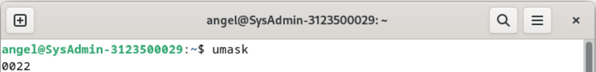

<div align="center">
  <h1 style="font-weight: bold"> Unix-and-Linux-sysadmin-notes <br> Rangkuman Chapter 5: The Filesystem </h1>
</div>
<br />
<br />
<div align="center">
  
</div>
<br />
<br />
<div align="center">
  <p style="line-height: 1.5"> Unix and Linux system administration handbook by Evi Nemeth Garth Snyder Trent R. Hein Ben Whaley Dan Mackin</h3>
  <p>
</div>

---
# Daftar Isi
- [Daftar Isi](#daftar-isi)
- [Chapter 5: The Filesystem](#chapter-5-the-filesystem)
  - [A. Sistem File dan Konsep Dasarnya\`](#a-sistem-file-dan-konsep-dasarnya)
  - [B. Pathname (Jalur File)](#b-pathname-jalur-file)
  - [C. Mounting dan Unmounting Filesystem](#c-mounting-dan-unmounting-filesystem)
    - [C.1 Mounting Filesystem](#c1-mounting-filesystem)
    - [C.2 Unmounting Filesystem](#c2-unmounting-filesystem)
  - [D. Organisasi File Tree](#d-organisasi-file-tree)
    - [D.1 Struktur Direktori Penting:](#d1-struktur-direktori-penting)
  - [E. Jenis File dalam Filesystem](#e-jenis-file-dalam-filesystem)
    - [E.1 Menentukan Jenis File](#e1-menentukan-jenis-file)
  - [F. Hard Links vs. Symbolic Links](#f-hard-links-vs-symbolic-links)
    - [F.1 Hard Links](#f1-hard-links)
    - [F.2 Symbolic Links (Soft Links)](#f2-symbolic-links-soft-links)
  - [G. File Perangkat (Character dan Block Device)](#g-file-perangkat-character-dan-block-device)
    - [G.1 Atribut File dalam UNIX dan Linux](#g1-atribut-file-dalam-unix-dan-linux)
    - [G.2 Bit Izin (Permission Bits)](#g2-bit-izin-permission-bits)
    - [G.3 Notasi Oktal untuk Izin](#g3-notasi-oktal-untuk-izin)
    - [G.4 Eksekusi File](#g4-eksekusi-file)
    - [G.5 Bit Setuid dan Setgid](#g5-bit-setuid-dan-setgid)
    - [G.6 Sticky Bit](#g6-sticky-bit)
    - [G.7 Perintah ls untuk Melihat Atribut File \`](#g7-perintah-ls-untuk-melihat-atribut-file-)
    - [Mengubah Izin dan Kepemilikan File di Unix/Linux](#mengubah-izin-dan-kepemilikan-file-di-unixlinux)
    - [G.8 chmod: Mengubah Izin File](#g8-chmod-mengubah-izin-file)
      - [G.8.1. Notasi Oktal dalam chmod](#g81-notasi-oktal-dalam-chmod)
      - [G.8.2 Notasi Simbolik dalam chmod](#g82-notasi-simbolik-dalam-chmod)
    - [G.9 chown: Mengubah Kepemilikan File](#g9-chown-mengubah-kepemilikan-file)
    - [G.10 chgrp: Mengubah Grup File](#g10-chgrp-mengubah-grup-file)
    - [G.11 umask: Menentukan Izin Default](#g11-umask-menentukan-izin-default)
  - [H. Access Control Lists (ACLs)](#h-access-control-lists-acls)
    - [H.1 Perintah Dasar ACL](#h1-perintah-dasar-acl)
    - [H.2 POSIX ACLs](#h2-posix-acls)
      - [H.2.1 Format POSIX ACLs](#h21-format-posix-acls)
    - [H.3. NFSv4 ACLs](#h3-nfsv4-acls)


---
# Chapter 5: The Filesystem


##  A. Sistem File dan Konsep Dasarnya`

&nbsp;&nbsp;&nbsp;&nbsp; Sistem file adalah cara untuk mewakili dan mengorganisir sumber daya penyimpanan dalam suatu sistem. Sistem file memiliki empat komponen utama:

1.  `Namespace ` – Cara memberi nama dan mengatur file dalam hierarki.
2.  `API (Application Programming Interface) ` – Sekumpulan perintah sistem untuk menavigasi dan memanipulasi objek.
3.  `Model Keamanan ` – Skema untuk melindungi, menyembunyikan, dan berbagi data.
4.  `Implementasi` ` – Perangkat lunak yang menghubungkan model logis dengan perangkat keras.

&nbsp;&nbsp;&nbsp;&nbsp; Beberapa sistem file yang umum digunakan pada media penyimpanan berbasis disk meliputi  ` ext4, XFS, UFS `, serta  ` ZFS dan Btrfs  ` dari Oracle. Ada juga sistem file lain seperti  ` VxFS dari Veritas ` dan  ` JFS dari IBM `.

&nbsp;&nbsp;&nbsp;&nbsp; Selain itu, terdapat  `sistem file asing `  seperti  ` FAT dan NTFS ` yang digunakan oleh Windows, serta  `ISO 9660 `  yang digunakan oleh CD dan DVD.

&nbsp;&nbsp;&nbsp;&nbsp; Sebagian besar sistem file modern bertujuan untuk meningkatkan kecepatan dan keandalan dibandingkan sistem file tradisional, atau menambahkan fitur tambahan di atas standar sistem file yang sudah ada.

---

##  B. Pathname (Jalur File) 

&nbsp;&nbsp;&nbsp;&nbsp; Dalam sistem Linux, istilah  `folder ` berasal dari dunia Windows dan macOS, sedangkan istilah teknis yang lebih umum digunakan adalah  ` directory (direktori)`. 

&nbsp;&nbsp;&nbsp;&nbsp; Jalur direktori yang mengarah ke suatu file disebut sebagai  `pathname `. Pathname dapat berupa:

-  `Absolute Path (Jalur Absolut) ` → Contoh: `/home/username/file.txt`
-  `Relative Path (Jalur Relatif)` → Contoh: `./file.txt`

---

##  C. Mounting dan Unmounting Filesystem

&nbsp;&nbsp;&nbsp;&nbsp; Sistem file terdiri dari beberapa bagian yang disebut  `filesystems `. Masing-masing bagian ini terdiri dari satu direktori utama, subdirektori, dan file-file di dalamnya. Istilah  `file tree (pohon file) ` digunakan untuk menyebut keseluruhan struktur sistem file, sedangkan  `filesystem ` merujuk pada cabang-cabang yang terhubung ke pohon tersebut.

### C.1 Mounting Filesystem
&nbsp;&nbsp;&nbsp;&nbsp; Untuk menambahkan sistem file ke dalam struktur yang ada, kita menggunakan perintah `mount`. Perintah ini menghubungkan sebuah direktori yang sudah ada (disebut  `mount point ` ) dengan akar dari sistem file baru.

 ` `Contoh Mounting: ` `
```bash


# Mount filesystem dari /dev/sda4 ke direktori /users
mount /dev/sda4 /users
```

###  C.2 Unmounting Filesystem 
&nbsp;&nbsp;&nbsp;&nbsp; Untuk melepaskan sistem file dari struktur, kita menggunakan perintah `umount`. Ada beberapa opsi dalam unmounting:

-  `Lazy Unmount (`umount -l`) `  
  Menghapus sistem file dari hierarki penamaan tetapi tidak benar-benar unmount hingga tidak lagi digunakan.
  
-  `Force Unmount (`umount -f`)`  
  Menghapus sistem file secara paksa, berguna saat sistem file sedang sibuk.

&nbsp;&nbsp;&nbsp;&nbsp; Sebelum menggunakan  `umount -f `, sebaiknya periksa dulu proses yang menggunakan sistem file dengan  ` ``lsof` ` ` atau  ` ``fuser` ` `.

 ` `Contoh Menemukan Proses yang Menggunakan Filesystem: ` `
```bash
# Menampilkan proses yang sedang menggunakan direktori /home/abdou
lsof /home/abdou
```

 ` Contoh Output: ` 
```
COMMAND   PID USER   FD   TYPE DEVICE SIZE/OFF   NODE NAME
bash     1000 abdou  cwd    DIR    8,1     4096  131073 /home/abdou
code     1234 abdou  cwd    DIR    8,1     4096  131073 /home/abdou
msedge   5678 abdou  cwd    DIR    8,1     4096  131073 /home/abdou
```

&nbsp;&nbsp;&nbsp;&nbsp; Untuk memeriksa lebih lanjut proses yang sedang berjalan, gunakan perintah  `ps`.

 ` `Contoh Menginvestigasi Proses yang Menggunakan Filesystem: ` `
```bash
# Menampilkan informasi detail proses dengan PID tertentu
ps up "1234 5678 91011"
```

  `Contoh Output: ` 
```
    USER       PID %CPU %MEM    VSZ   RSS TTY      STAT START   TIME COMMAND
    abdou     1234  0.0  0.0  12345  1234 ?        Ssl  00:00   0:00 code
    abdou     5678  0.0  0.0  12345  1234 ?        Ssl  00:00   0:00 msedge
    abdou     91011  0.0  0.0  12345  1234 ?        Ssl  00:00   0:00 chrome
```

&nbsp;&nbsp;&nbsp;&nbsp; Dengan mengetahui proses yang sedang menggunakan sistem file, kita bisa menutupnya sebelum melakukan unmount agar lebih aman.


## D. Organisasi File Tree

&nbsp;&nbsp;&nbsp;&nbsp; Sistem UNIX sebenarnya tidak terlalu terorganisir dengan baik. Ada banyak konvensi penamaan yang tidak kompatibel yang digunakan secara bersamaan, dan berbagai jenis file tersebar secara acak di dalam namespace. `Inilah salah satu alasan mengapa upgrade sistem operasi bisa menjadi sulit`.  

&nbsp;&nbsp;&nbsp;&nbsp; Filesystem root (/) mencakup setidaknya direktori root itu sendiri dan beberapa file serta subdirektori penting. File yang berisi kernel sistem operasi biasanya berada di dalam `/boot`, tetapi lokasi dan namanya bisa bervariasi tergantung pada sistem. Di BSD dan beberapa sistem UNIX lainnya, kernel tidak hanya terdiri dari satu file, tetapi dari beberapa komponen.  

### D.1 Struktur Direktori Penting:  

-  `/etc ` – berisi file sistem dan konfigurasi yang penting.  
-  `/sbin ` &  `/bin ` – menyimpan utilitas utama yang dibutuhkan untuk operasi sistem.  
-  `/tmp ` – digunakan untuk file sementara.  
-  `/dev ` – sebelumnya merupakan bagian dari root filesystem, tetapi sekarang lebih sering digunakan sebagai filesystem virtual yang dimount secara terpisah.  
-  `/lib ` &  `/lib64 ` – menyimpan file library yang diperlukan sistem, meskipun beberapa sistem memindahkannya ke  `/usr/lib `.  
-  `/usr ` – tempat penyimpanan program yang tidak terlalu penting untuk sistem, termasuk dokumentasi dan pustaka tambahan.  
-  `/var ` – digunakan untuk direktori spool, file log, informasi akuntansi, serta berbagai file yang sering berubah dan berkembang dalam ukuran.  

Baik  `/usr ` maupun  `/var ` sangat penting karena harus tersedia agar sistem dapat beroperasi dalam mode multiuser.  

---

## E. Jenis File dalam Filesystem  

&nbsp;&nbsp;&nbsp;&nbsp; Sebagian besar filesystem UNIX/Linux mendefinisikan  `tujuh jenis file `, yaitu:  

1.  `Regular files ` – File biasa yang terdiri dari serangkaian byte. Ini termasuk file teks, data, program eksekusi, dan pustaka yang digunakan oleh sistem.  
2.  `Directories ` – Direktori adalah referensi yang menunjuk ke file lain dalam sistem.  
3.  `Character devices files ` – File perangkat karakter, digunakan untuk berkomunikasi dengan perangkat keras secara langsung dalam bentuk aliran byte.  
4.  `Block devices files ` – Mirip dengan perangkat karakter, tetapi digunakan untuk perangkat penyimpanan blok seperti hard drive dan SSD.  
5.  `Local domain sockets ` – Digunakan untuk komunikasi antar proses dalam satu host, mirip dengan socket jaringan tetapi hanya berlaku di dalam sistem lokal.  
6.  `Named pipes (FIFOs) ` – Memungkinkan proses yang berjalan di dalam satu host untuk berkomunikasi satu sama lain.  
7.  `Symbolic links ` – Link simbolis atau "soft link" yang menunjuk ke file lain berdasarkan namanya.  

### E.1 Menentukan Jenis File  
Kita bisa menggunakan perintah  `file ` untuk mengetahui tipe file:  

```bash
$ file /bin/bash
/bin/bash: ELF 64-bit LSB pie executable, x86-64, version 1 (SYSV), dynamically linked, ...
```

Atau menggunakan  `ls -ld `, di mana opsi  `-d ` memaksa  `ls ` untuk menampilkan informasi direktori alih-alih isinya.  

---

## F. Hard Links vs. Symbolic Links  

### F.1 Hard Links  
&nbsp;&nbsp;&nbsp;&nbsp; Hard link memungkinkan satu file memiliki beberapa nama yang berbeda. Hard link menunjuk langsung ke inode file yang sama, sehingga perubahan pada satu hard link akan berdampak pada semua link lainnya.  

Contoh membuat hard link:  

```bash
$ ln /etc/passwd /tmp/passwd
```

### F.2 Symbolic Links (Soft Links)  
&nbsp;&nbsp;&nbsp;&nbsp; Symbolic link menunjuk ke file lain berdasarkan nama, bukan inode. Ini lebih fleksibel dibanding hard link karena bisa menunjuk ke file yang berada di filesystem lain atau bahkan ke direktori.  

Contoh membuat symbolic link:  

```bash
$ ln -s /bin /usr/bin

$ ls -l /usr/bin
lrwxrwxrwx 1 root root 4 Mar  1  2020 /usr/bin -> /bin
```

&nbsp;&nbsp;&nbsp;&nbsp; Dengan menggunakan  `symbolic link `, kita dapat mengorganisir sistem dengan lebih efisien tanpa memindahkan file secara fisik.  

- Percobaan ls -l:


  


  
  
  

---

## G. File Perangkat (Character dan Block Device)  

&nbsp;&nbsp;&nbsp;&nbsp; File perangkat memungkinkan program berkomunikasi dengan perangkat keras. Kernel mengelola perangkat ini melalui driver khusus, sehingga program dapat mengaksesnya tanpa harus menangani detail perangkat keras.  

Setiap perangkat memiliki  `nomor major dan minor `:  
-  `Major number ` – Menunjukkan driver mana yang mengendalikan perangkat.  
-  `Minor number ` – Menunjukkan unit perangkat spesifik yang dikendalikan oleh driver.  

Sebagai contoh, pada sistem Linux,  `major device number 4 ` biasanya digunakan untuk driver port serial:  
-  `/dev/tty0 ` – memiliki major device number 4, minor device number 0.  
-  `/dev/tty1 ` – memiliki major device number 4, minor device number 1.  

&nbsp;&nbsp;&nbsp;&nbsp; Sebelumnya, file perangkat dibuat menggunakan  `mknod `, tetapi sekarang  `/dev ` biasanya merupakan filesystem virtual yang dikelola secara otomatis oleh kernel dan daemon sistem.  

---

### G.1 Atribut File dalam UNIX dan Linux

&nbsp;&nbsp;&nbsp;&nbsp; Pada sistem UNIX dan Linux, setiap file memiliki serangkaian  `sembilan bit izin (permission bits) ` yang menentukan siapa yang dapat membaca, menulis, dan mengeksekusi file tersebut. Selain itu, terdapat tiga bit tambahan yang terutama mempengaruhi cara program dieksekusi. Kedua kelompok bit ini dikenal sebagai  `mode file `.

&nbsp;&nbsp;&nbsp;&nbsp; Total terdapat  `dua belas bit mode `, yang disimpan bersama dengan  `empat bit tipe file `. Keempat bit tipe file ini ditetapkan saat file dibuat dan tidak dapat diubah, tetapi pemilik file dan  `superuser (root) ` dapat memodifikasi dua belas bit mode menggunakan perintah  `chmod `.

---

### G.2 Bit Izin (Permission Bits)

&nbsp;&nbsp;&nbsp;&nbsp; Bit izin dibagi menjadi  `tiga kelompok `, masing-masing terdiri dari  `tiga bit `:

1.  `Pemilik file (Owner - u) `
2.  `Grup file (Group - g) `
3.  `user lain (Others - o) `

&nbsp;&nbsp;&nbsp;&nbsp;Urutan ini dapat diingat dengan singkatan  `Hugo ` ( `u ` untuk pemilik,  `g ` untuk grup,  `o ` untuk lainnya).

Setiap kelompok memiliki izin sebagai berikut:
-  `r (read - 4) `: dapat membaca file
-  `w (write - 2) `: dapat mengubah/menghapus isi file
-  `x (execute - 1) `: dapat mengeksekusi file (jika file adalah program atau skrip)

### G.3 Notasi Oktal untuk Izin
&nbsp;&nbsp;&nbsp;&nbsp; Selain notasi simbolik (rwx), UNIX/Linux juga menggunakan  `notasi oktal (basis 8) `. Setiap digit oktal mewakili  `tiga bit izin `:
- Pemilik: 400, 200, 100 (r, w, x)
- Grup: 40, 20, 10 (r, w, x)
- Lainnya: 4, 2, 1 (r, w, x)

Misalnya:
```bash
chmod 755 file.sh
```
Artinya:
-  `7 (rwx) ` untuk pemilik
-  `5 (r-x) ` untuk grup
-  `5 (r-x) ` untuk lainnya

- Percobaan notasi oktal perizinan file

  
  


---

###  G.4 Eksekusi File
- Bit eksekusi ( `x `) memungkinkan file dijalankan sebagai program.
- File eksekusi bisa berupa  `biner ` (langsung dijalankan oleh CPU) atau  `skrip ` (ditafsirkan oleh program lain seperti Bash atau Python).
- Skrip biasanya diawali dengan  `shebang ` (`#!`) untuk menunjukkan interpreter yang digunakan, misalnya:
  ```bash
  #!/usr/bin/perl
  ```
- Jika interpreter tidak ditentukan dengan benar, kernel akan menolak file tersebut.

Untuk  `direktori `, bit eksekusi memiliki fungsi khusus:
-  `x (execute/search bit) ` memungkinkan   user masuk ke dalam direktori.
-  `r (read) + x (execute) ` memungkinkan daftar isi direktori dilihat.
-  `w (write) + x (execute) ` memungkinkan pembuatan, penghapusan, dan perubahan nama file dalam direktori.

- Percobaan eksekusi file
  
  

---

### G.5 Bit Setuid dan Setgid
-  `Setuid (bit oktal 4000) `: Jika file dengan bit ini dijalankan, proses akan berjalan dengan hak akses  `pemilik file `, bukan   user yang menjalankan.
-  `Setgid (bit oktal 2000) `:
  - Untuk file: Mirip dengan setuid, tetapi berlaku untuk grup.
  - Untuk direktori: Semua file yang dibuat di dalam direktori ini akan otomatis memiliki grup yang sama dengan direktori tersebut. Berguna untuk kerja sama tim.

---

###  G.6 Sticky Bit 
-  `Bit dengan nilai oktal 1000 `.
- Digunakan pada direktori umum seperti  `/tmp `.
- Mencegah   user menghapus atau mengganti nama file milik   user lain di direktori yang sama.

---

###  G.7 Perintah ls untuk Melihat Atribut File `
- Perintah  `ls -l ` menampilkan informasi lengkap tentang file atau direktori, termasuk mode file, pemilik, grup, ukuran, dan waktu modifikasi.
  
  Contoh output:
  ```bash
  $ ls -l /dev/tty0
  crw--w---- 1 root tty 4, 0 Mar  1  2020 /dev/tty0
  ```
  -  `c `: menunjukkan bahwa ini adalah file perangkat karakter.
  -  `4, 0 `: adalah  `major number ` dan  `minor number ` untuk mengidentifikasi perangkat keras.
    

  - Percobaan ls -l

    

---
  ### Mengubah Izin dan Kepemilikan File di Unix/Linux

###  G.8 chmod: Mengubah Izin File
Perintah  `chmod ` digunakan untuk mengubah izin (mode) file atau direktori. Anda dapat menggunakan  `notasi oktal ` atau  `notasi simbolik ` untuk menentukan izin.

####  G.8.1. Notasi Oktal dalam chmod
Setiap angka dalam notasi oktal mewakili tiga bit izin:

-  `4 ` = read ( `r `) – membaca file
-  `2 ` = write ( `w `) – mengubah atau menghapus file
-  `1 ` = execute ( `x `) – mengeksekusi file atau mengakses direktori

Misalnya:
```bash
chmod 755 file.txt
```
Artinya:
-  `7 (rwx) ` – pemilik memiliki izin baca, tulis, dan eksekusi.
-  `5 (r-x) ` – grup hanya memiliki izin baca dan eksekusi.
-  `5 (r-x) ` – lainnya juga hanya memiliki izin baca dan eksekusi.

- Percobaan notasi oktal perizinan file

  


####  G.8.2 Notasi Simbolik dalam chmod
Selain notasi oktal, Anda bisa menggunakan notasi simbolik untuk menyesuaikan izin:

| Spesifikasi | Arti                                                          |
| ----------- | ------------------------------------------------------------- |
| `u+w`       | Tambahkan izin tulis untuk pemilik                            |
| `ug=rw,o=r` | Pemilik dan grup memiliki izin baca/tulis, lainnya hanya baca |
| `a-x`       | Hapus izin eksekusi untuk semua pengguna                      |
| `g=u`       | Set izin grup sama seperti pemilik                            |

Jika Anda ingin menyalin izin dari file lain, gunakan opsi  `--reference `:
```bash
chmod --reference=sourcefile targetfile
```

- Percobaan notasi simbolik
  
  
  
---

###  G.9 chown: Mengubah Kepemilikan File
Perintah  `chown ` digunakan untuk mengubah pemilik dan grup dari sebuah file atau direktori.

 `Contoh: `
```bash
chown -R abdou:users /home/abdou
```
- `-R` berarti  `rekursif `, yaitu mengubah kepemilikan semua file dan subdirektori di dalamnya.

---

###  G.10 chgrp: Mengubah Grup File
Perintah  `chgrp ` digunakan untuk mengubah grup yang memiliki file atau direktori.

 `Contoh: `
```bash
chgrp -R users /home/abdou
```
- `-R` digunakan untuk menerapkan perubahan pada seluruh isi direktori.

- Percobaan chgrp

  

  
  

---

###  G.11 umask: Menentukan Izin Default
Perintah  `umask ` menentukan izin default untuk file dan direktori yang baru dibuat. Nilai  `umask ` adalah bit yang akan  `dikurangi ` dari izin default sistem.

 `Contoh: `
```bash
umask 022
```

- Percobaan `umask 022`

  

Artinya:
- File yang baru dibuat akan memiliki izin  `755 ` (rwxr-xr-x) karena defaultnya adalah  `777 `.
- Direktori yang baru dibuat akan memiliki izin  `755 `.

Tabel referensi  `umask `:

| Oktal | Biner | Izin yang Diblokir          |
| ----- | ----- | --------------------------- |
| 0     | 000   | rwx (baca, tulis, eksekusi) |
| 2     | 010   | r-x (tidak bisa menulis)    |
| 7     | 111   | --- (tidak memiliki izin)   |

Misalnya,  `umask 027 ` menghasilkan izin  `750 ` untuk direktori baru:
- Pemilik:  `rwx `
- Grup:  `rx `
- Lainnya:  `tidak memiliki izin `

- Percobaan `umask 027`
  
  

---

##  H. Access Control Lists (ACLs)
&nbsp;&nbsp;&nbsp;&nbsp; Model izin tradisional Unix terkadang kurang fleksibel, terutama dalam mengelola file yang perlu diakses oleh banyak pengguna dengan tingkat izin yang berbeda.  `ACL (Access Control Lists) ` digunakan untuk memperluas model izin Unix agar lebih fleksibel.

### H.1 Perintah Dasar ACL 
1.  `Melihat ACL file: `
   ```bash
   getfacl /etc/passwd
   ```
2.  `Menambahkan izin ACL ke pengguna tertentu: `
   ```bash
   setfacl -m u:abdou:rw /etc/passwd
   ```

---

### H.2 POSIX ACLs 
&nbsp;&nbsp;&nbsp;&nbsp; POSIX ACLs adalah jenis ACL yang lebih sederhana dan digunakan di banyak sistem Unix/Linux.

#### H.2.1 Format POSIX ACLs 
| Format                  | Contoh            | Keterangan                          |
| ----------------------- | ----------------- | ----------------------------------- |
| `user::perms`           | `user::rw-`       | Izin pemilik file                   |
| `user:username:perms`   | `user:abdou:rw-`  | Izin khusus untuk pengguna tertentu |
| `group::perms`          | `group:r-x`       | Izin untuk grup pemilik file        |
| `group:groupname:perms` | `group:users:r-x` | Izin khusus untuk grup tertentu     |
| `mask::perms`           | `mask::rwx`       | Izin maksimum yang dapat diberikan  |
| `other::perms`          | `other::r--`      | Izin untuk pengguna lainnya         |

 `Contoh Penggunaan POSIX ACLs `
```bash
setfacl -m user:abdou:rwx,group:users:rwx,other::r /home/abdou
```
Lalu cek izin dengan:
```bash
getfacl --omit-header /home/abdou
```
Hasilnya:
```
user::rwx
user:abdou:rwx
group::r-x
group:users:r-x
mask::rwx
other::r--
```

---

###  H.3. NFSv4 ACLs 
&nbsp;&nbsp;&nbsp;&nbsp; NFSv4 ACLs adalah versi yang lebih canggih dibanding POSIX ACLs dan mendukung lebih banyak fitur seperti  `default ACL `, yang digunakan untuk mengatur izin pada file dan direktori yang baru dibuat.

 `Kesimpulan: `
- Gunakan  `chmod ` untuk mengatur izin dasar.
- Gunakan  `chown ` dan  `chgrp ` untuk mengelola kepemilikan.
- Gunakan  `umask ` untuk menentukan izin default file baru.
- Gunakan  `ACLs (setfacl/getfacl) ` untuk memberikan izin lebih spesifik kepada banyak user.

