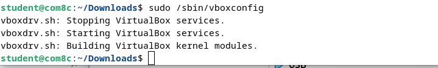
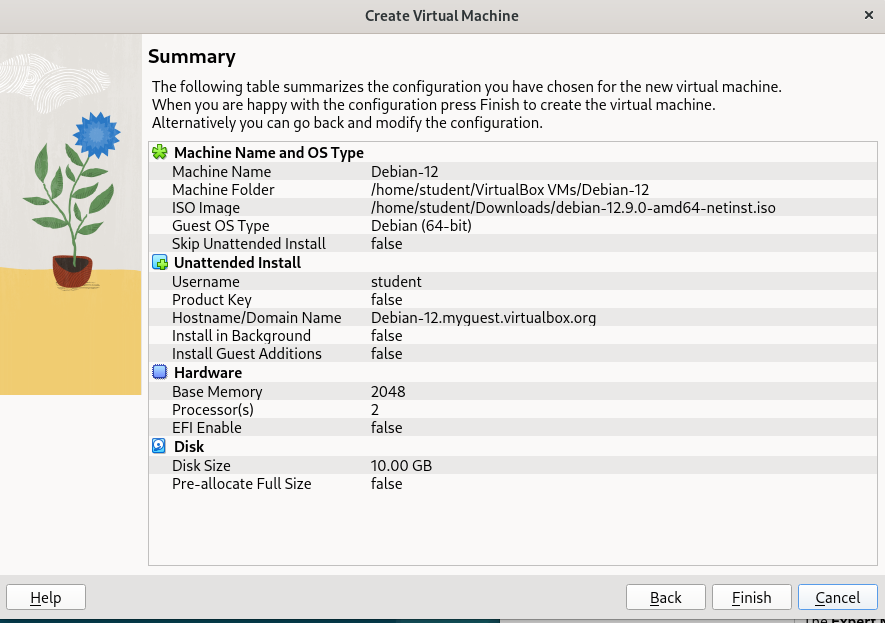

<div align="center">
  <h1 style="font-weight: bold"> LAPORAN PRAKTIKUM 2 WORKSHOP ADMINISTRASI JARINGAN <br> Debian Installation </h1>
  <h4 style="text-align: center;">Dosen Pengampu : Dr. Ferry Astika Saputra, S.T., M.Sc.</h4>
</div>
<br />
<br />
<div align="center">
  
  <h3 style="text-align: center;">Disusun Oleh : </h3>
  <p style="text-align: center;">
    Firsty Angelica Valency (3123500029)<br>
  </p>
  <h3 style="text-align: center;line-height: 1.5">Program Studi Teknik Informatika<br>Departemen Teknik Informatika Dan Komputer<br>Politeknik Elektronika Negeri Surabaya<br>2024/2025</h3>
  <hr>
</div>

# Daftar Isi

- [Daftar Isi](#daftar-isi)
- [Unix-and-Linux-sysadmin-notes](#unix-and-linux-sysadmin-notes)
- [Debian Installation](#debian-installation)
- [Kesimpulan](#kesimpulan)


---
# Unix-and-Linux-sysadmin-notes

  Unix and Linux system administration handbook by Evi Nemeth Garth Snyder Trent R. Hein Ben Whaley Dan Mackin

  

  Rangkuman :
  - [Chapter 4: Process Control](Chapter4_ProcessControl.md)
  - [Chapter 5: The Filesystem](Chapter5_TheFileSystem.md)
  - [Chapter 6: Software Installation](Chapter6_SoftwareInstallation.md)

---

# Debian Installation

1. Checking hardware 
   
2. Menjalankan perintah git clone untuk mengunduh repo
   
    
   
    &nbsp;&nbsp;&nbsp;&nbsp; Seperti yang tertera pada gambar di atas, git clone tidak bisa dijalankan di terminal, maka kita harus mengunduh git dengan perintah: 

    ```bash
    sudo apt install git
    ```

3. Menjalankan perintah git clone untuk mengunduh repo
   
    

    ```bash
    git clone https://github.com/ferryastika/unix-and-linux-sysadmin-notes.git

    ```
    &nbsp;&nbsp;&nbsp;&nbsp; Setelah mengunduh repo, kita akan menemukan folder bernama `unix-and-linux-sysadmin-notes` di dalam direktori `/home/ferryastika/`

4. Mengunduh virtual machine
  
     &nbsp;&nbsp;&nbsp;&nbsp; Untuk mengunduh virtual machine, kita bisa menggunakan link berikut: 
     
     ```bash
     https://www.virtualbox.org/wiki/Downloads
     ```

     &nbsp;&nbsp;&nbsp;&nbsp; Setelah mengunduh virtual machine, kita akan menemukan folder bernama `VirtualBox` di dalam direktori `/home/ferryastika/`

5. Menjalankan virtual machine
   
    

    &nbsp;&nbsp;&nbsp;&nbsp; Untuk menjalankan virtual machine kita masuk di directory download, lalu kita akan menjalankan virtual machine dengan perintah berikut:

    ```bash
    cd ~/Downloads $sudo dpkg -i ~/Downloads/VirtualBox-6.1_6.1.16-136998~Ubuntu~bionic_amd64.deb 
    ```
    &nbsp;&nbsp;&nbsp;&nbsp; Dapat diketahui bahwa konfigurasi depedencynya terdapat masalah sehingga prosesnya gagal dan tidak terinstall. Setalah mencari fixing bug di stack overflow Masalah ini dapat diselesaikan dengan menggunakan perintah berikut:

    


    ```bash
    sudo apt install -f
    ``` 

6. Menjalankan virtual machine
   
    

    

    &nbsp;&nbsp;&nbsp;&nbsp; Setelah menjalankan virtual machine, terdapat masalah login error pada kernel. pesan errornya adalah `cant enumarate USB device` dan kita bisa menggunakan perintah berikut untuk mengatasi masalah ini:

    

    

    ```bash
    $sudo apt update

    $sudo apt install dkms build-essential linux-headers-$(uname -r)

    $sudo /sbin/vboxconfig
    ```

    

    

  7. Downloading ISO

     
     
     &nbsp;&nbsp;&nbsp;&nbsp; Mengunduh ISO dari link berikut:
     
     ```bash
     https://cdimage.debian.org/debian-cd/current/amd64/iso-cd/debian-12.0.0-amd64-netinst.iso
     ```  
     &nbsp;&nbsp;&nbsp;&nbsp; Setelah mengunduh ISO, kita akan menemukan file ISO di dalam direktori `/home/ferryastika/Downloads/`

     Atau bisa mengunduh ISO dengan perintah berikut:

     ```bash
     ~ Downloads $sftp 10.252.108.107
     ```

  8. Installing debian dengan set-up virtual machine
     
     

     &nbsp;&nbsp;&nbsp;&nbsp; Setelah menjalankan virtual machine, kita akan menemukan file ISO di dalam direktori `/home/ferryastika/Downloads/`
     
     
     
     &nbsp;&nbsp;&nbsp;&nbsp; Melakukan setting username dengan nama student dan password dengan password yang sama.

      

      &nbsp;&nbsp;&nbsp;&nbsp; Setting up Base Memory Size sebesar 2048 MB dan Processor Count sebesar 2 (jika memiliki dua core)

      

      &nbsp;&nbsp;&nbsp;&nbsp; Setting Virtual Hard Disk sebesar 10 GB dan virtual hard disk file sebesar debian-12.9.0-amd64-netinst.iso

      

      &nbsp;&nbsp;&nbsp;&nbsp; Gambar diatas adalah informasi yang kita dapatkan dari virtual machine yang sudah kita buat sebelumnya.
--- 

# Kesimpulan

&nbsp;&nbsp;&nbsp;&nbsp; Dalam bab ini, kita telah mempelajari beberapa konsep penting terkait **File System**, **Process Control**, dan **Software Installation** di Linux, serta langkah-langkah praktis untuk mengelola file dan perangkat lunak di sistem Linux.

1. **File System**:
   - Menggunakan perintah seperti `git clone` untuk mengunduh repositori dan menyimpan file di dalam direktori yang terstruktur.
   - Dengan **Access Control Lists (ACLs)**, kita dapat memberikan izin akses yang lebih spesifik untuk pengguna dan grup tertentu, yang lebih fleksibel dibandingkan izin tradisional Unix.

2. **Process Control**:
   - Pengelolaan **virtual machine** menunjukkan cara mengatasi masalah kernel dan dependensi dengan perintah seperti `sudo apt install`, `dkms`, dan `vboxconfig`.
   - Ini juga membantu kita mengatasi masalah perangkat keras virtual yang memengaruhi proses virtualisasi.

3. **Software Installation**:
   - Instalasi perangkat lunak seperti **Git**, **VirtualBox**, dan **Debian ISO** mengajarkan cara mengunduh dan mengonfigurasi perangkat lunak di Linux menggunakan perintah seperti `sudo apt install`, `git clone`, dan `sftp`.
   - Proses ini juga memberikan pemahaman tentang mengelola perangkat lunak dan menyelesaikan masalah instalasi.

Secara keseluruhan, bab ini memberikan gambaran tentang cara mengelola file, mengontrol proses, serta menginstal perangkat lunak di Linux dengan menggunakan berbagai alat dan perintah yang tersedia.


