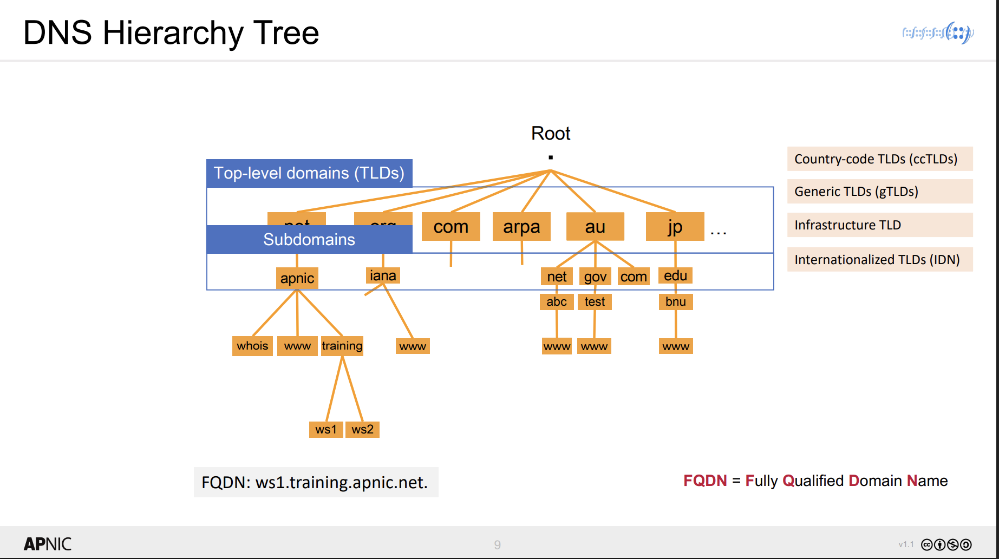
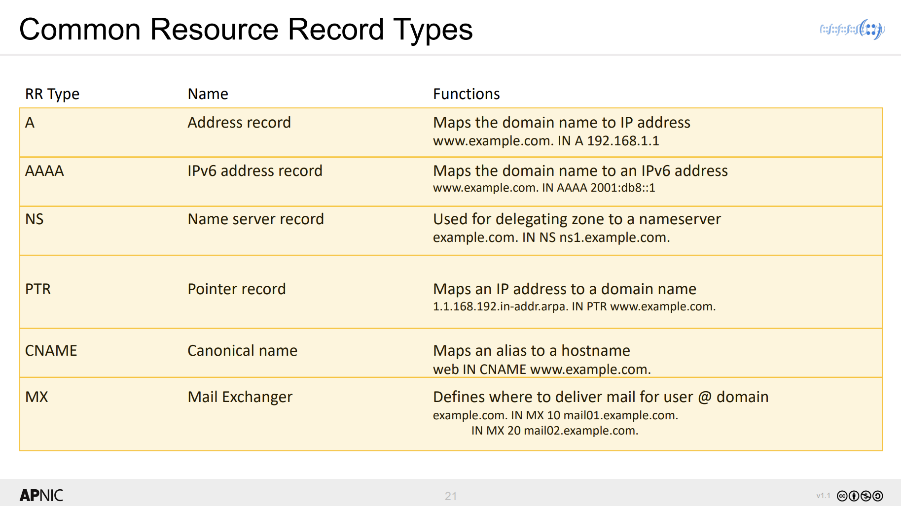
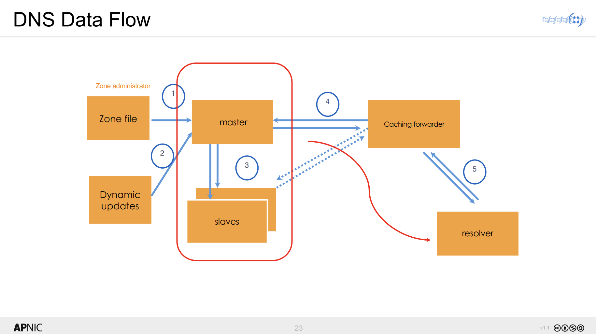
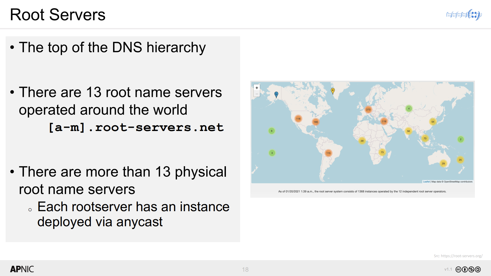
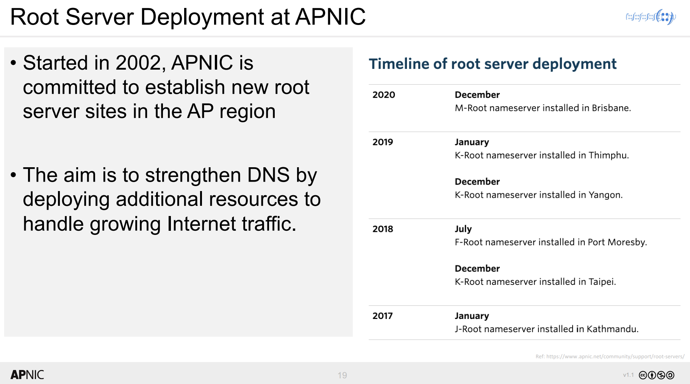

## **A.1 DNS Concept**

### **1. Pengenalan DNS**
- **Apa itu DNS?**
  - DNS (Domain Name System) adalah seperti "buku telepon" internet. Ketika kita mengetik nama website (seperti `www.apnic.net`), DNS mengubahnya menjadi alamat IP (seperti `202.112.0.46`) yang digunakan komputer untuk menemukan situs tersebut.
  - **Fungsi utama DNS**:
    - Mengubah nama domain menjadi alamat IP.
    - Membantu mengatur siapa yang bertanggung jawab atas bagian tertentu dari internet (misalnya, siapa yang mengelola `apnic.net`).
    - Memungkinkan perubahan informasi DNS tanpa mengganggu internet.

---

### **2. Struktur Hierarki DNS**
**Bagaimana DNS diatur?**

  - DNS memiliki struktur seperti pohon:
    - **Root (Akar)**: Puncak hierarki, diwakili oleh titik (`.`).
    - **Top-Level Domains (TLD)**: Domain tingkat atas seperti `.com`, `.net`, `.org`, atau domain negara seperti `.au` (Australia) dan `.jp` (Jepang).
    - **Subdomain**: Domain di bawah TLD, seperti `apnic.net` atau `training.apnic.net`.
    - **FQDN (Fully Qualified Domain Name)**: Nama domain lengkap, seperti `ws1.training.apnic.net.`.
---

### **3. Komponen DNS**
- **Apa saja bagian-bagian DNS?**
  - **Namespace**: Ruang nama yang berisi semua domain dan subdomain.
  - **Nameserver**: Server yang menyimpan informasi DNS dan menjawab pertanyaan tentang domain.
    - **Authoritative Nameserver**: Server yang memiliki informasi resmi tentang domain tertentu.
    - **Recursive Nameserver**: Server yang mencari informasi DNS untuk klien.
  - **Resolver**: software di komputer kita yang meminta informasi DNS dari nameserver.

---

### **4. Zona dan Delegasi**
- **Apa itu Zona?**
  - Zona adalah bagian dari DNS yang dikelola oleh seseorang atau organisasi. Misalnya, `apnic.net` adalah zona yang dikelola oleh APNIC.
  - **Delegasi**: Jika APNIC ingin mendelegasikan bagian dari zona mereka (misalnya, `training.apnic.net`) ke orang lain, mereka bisa melakukannya dengan menambahkan catatan khusus (NS Records) yang menunjukkan siapa yang bertanggung jawab.

  **Gambar yang Direkomendasikan**:
  - **Proses Delegasi**: Gambar diagram yang menunjukkan bagaimana zona `apnic.net` mendelegasikan `training.apnic.net` ke nameserver lain. Tempatkan gambar ini di **Slide 24** untuk menjelaskan konsep delegasi.

---

### **5. Resource Records (Catatan Sumber Daya)**
**Apa itu Resource Records?**

  - Resource Records (RR) adalah catatan dalam file DNS yang menyimpan informasi tentang domain. Beberapa jenis RR yang penting:
    - **A**: Mengubah nama domain ke alamat IPv4.
    - **AAAA**: Mengubah nama domain ke alamat IPv6.
    - **MX**: Menunjukkan server email untuk domain.
    - **CNAME**: Membuat alias untuk nama domain (misalnya, `web.apnic.net` bisa mengarah ke `www.apnic.net`).

---

### **6. Proses Permintaan DNS (DNS Query)**
**Bagaimana DNS bekerja saat kita membuka website?**

  1. kita mengetik `www.apnic.net` di browser.
  2. **Resolver** di komputer kita meminta informasi ke **recursive nameserver**.
  3. **Recursive nameserver** mencari informasi mulai dari root server, TLD server, hingga authoritative nameserver untuk `apnic.net`.
  4. **Authoritative nameserver** memberikan alamat IP `202.112.0.46`, dan browser kita mengakses situs tersebut.

  **Gambar yang Direkomendasikan**:
  - **Aliran Data DNS**: Diagram yang menunjukkan alur permintaan DNS dari resolver ke authoritative nameserver. Tempatkan gambar ini di **Slide 23** untuk menjelaskan proses query DNS.

---

### **7. Root Servers (Server Root)**
**Apa itu Root Servers?**

  - Root servers adalah server DNS paling atas dalam hierarki DNS. Ada 13 root server di seluruh dunia, tetapi sebenarnya ada banyak server fisik yang tersebar untuk memastikan kekitalan.
  - **APNIC** telah membantu menginstal beberapa root server di Asia-Pasifik untuk memperkuat DNS di wilayah ini.

  **Gambar yang Direkomendasikan**:
  - **Root Server Deployment**: Peta dunia yang menunjukkan lokasi root server, termasuk yang diinstal oleh APNIC. Tempatkan gambar ini di **Slide 19** untuk menjelaskan peran APNIC dalam root server.

---

### **8. Best Practices dalam Mengelola DNS**
- **Tips untuk mengelola DNS dengan baik**:
  - Gunakan **beberapa authoritative nameserver** untuk menghindari kegagalan.
  - Gunakan **cache** untuk mempercepat respons dan mengurangi beban server.
  - Sesuaikan **timer SOA dan TTL** untuk mengoptimalkan kinerja DNS.

---

### **9. Kesimpulan**
- **DNS** adalah sistem penting yang memungkinkan kita menggunakan nama domain (seperti `www.apnic.net`) alih-alih alamat IP yang rumit.
- Dengan memahami DNS, kita bisa mengelola website dan layanan internet dengan lebih baik.
- **Gambar yang Direkomendasikan**:
  - **Hierarki DNS**: Pohon hierarki DNS (Slide 9).
  - **Proses Delegasi**: Diagram delegasi zona (Slide 24).
  - **Aliran Data DNS**: Diagram alur query DNS (Slide 23).

---