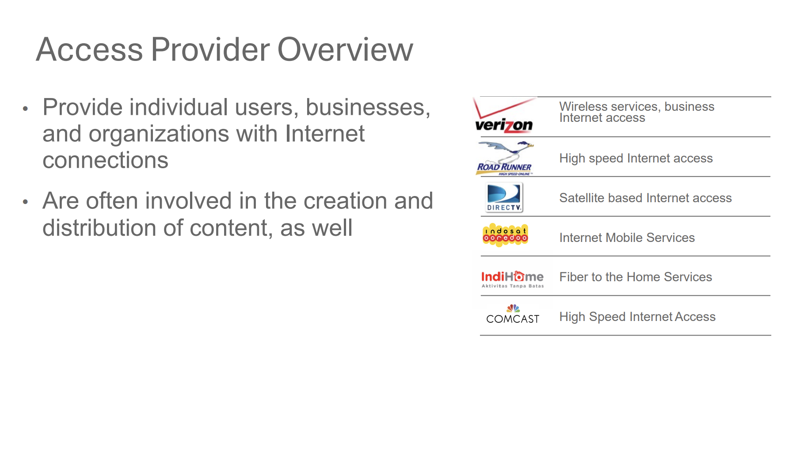
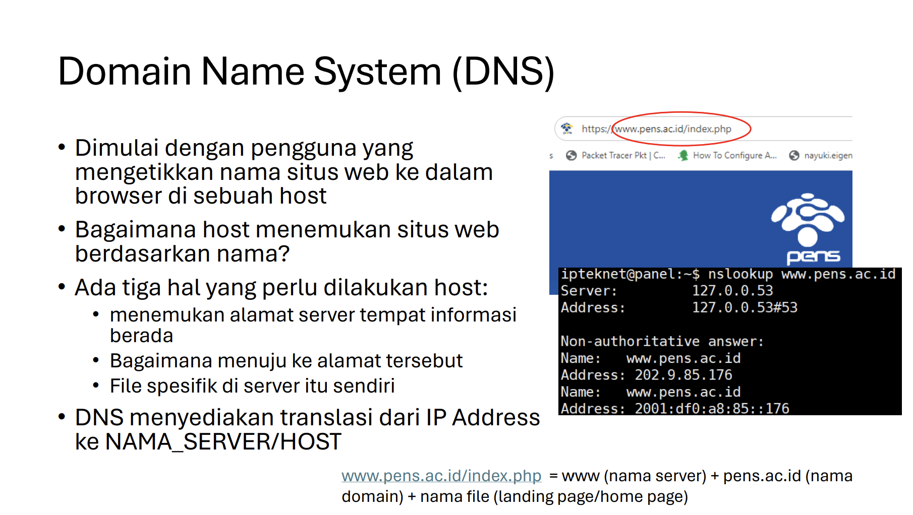
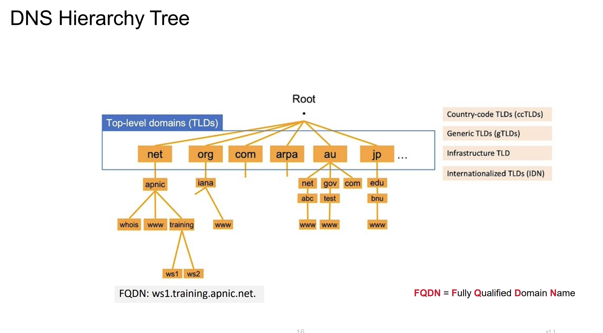
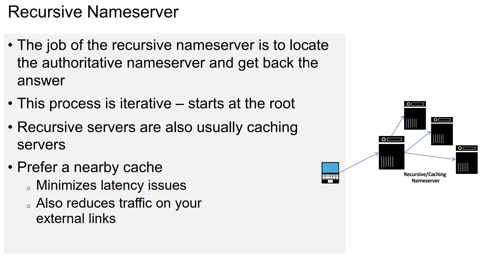
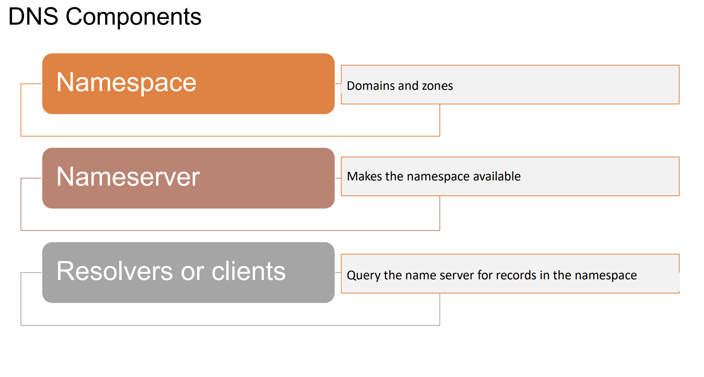
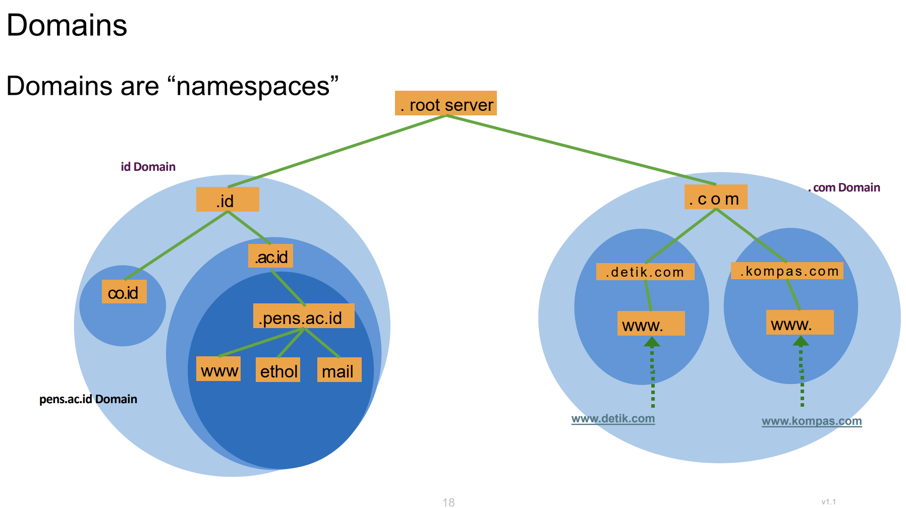

## **A.2 Ekosistem Internet**

### **Tiga Kunci Sukses Internet**
1. **Kepemilikan Global Bersama**:
   - Internet bukan milik satu orang atau perusahaan. Internet adalah milik bersama, diatur oleh banyak pihak yang bekerja sama untuk menjaga internet tetap berfungsi.

2. **Pengembangan Standar Terbuka**:
   - Internet menggunakan standar yang terbuka, artinya siapa pun bisa melihat dan mengembangkan teknologi internet tanpa harus membayar lisensi.

3. **Proses Pengembangan Teknologi dan Kebijakan yang Dapat Diakses Secara Bebas**:
   - Proses pengembangan internet terbuka untuk semua orang. Komunitas, seperti **IETF** (Internet Engineering Task Force), bekerja sama untuk membuat aturan dan teknologi baru.
  
---

### **Internet dapat dipandang dari 2 sisi**

A. **Teknis**
1. Routing system (system routing)
2. Naming system (sistem penamaan)
   
B.  Arsitektur
1. Standards (standarisasi)
2.  Service Providers (penyedia layanan)
3.  Internet Registries (Internet register)
4.  Clearing Houses (Rumah kliring)

---

### **Siapa yang Membuat Kebijakan?**
- **Komunitas**: Orang-orang yang peduli terhadap internet, seperti **IETF**, **IANA**, dan **ICANN**.
  - **IETF**: Membuat standar teknis seperti protokol internet (contoh: TCP/IP).
  - **IANA**: Membagi alamat IP ke seluruh dunia. Misalnya, di Asia ada **APNIC** (Asia-Pacific Network Information Centre), dan di Indonesia ada **APJII** (Asosiasi Penyelenggara Jasa Internet Indonesia).
  - **ICANN**: Mengatur nama domain (seperti `.com`, `.id`). Di Indonesia, **PANDI** (Pengelola Nama Domain Internet Indonesia) yang mengelola domain `.id`.

---

### **Peering Connection (Koneksi Peering)**
- **Kabel Laut atau Submarine Cable map**:
    Internet terhubung melalui kabel bawah laut. Misalnya, dari Surabaya ke Batam, lalu ke Taiwan, dan akhirnya ke Amerika.
  - **IP Transit**: Data mentah dari router disebut **pra IP transit**. Perusahaan seperti **Telkom** atau **Indihome** mengelola koneksi ini.

---

### **Edge Provider (Penyedia Layanan Internet)**

- **Contoh**: Indihome, Telkom, MyRepublic, dll.
  - Mereka menyediakan layanan internet ke pengguna akhir (end-user).
  
---

### **Domain Name System (DNS)**

- **Mengapa DNS Penting?**:
  - Manusia lebih mudah mengingat nama (seperti `www.pens.ac.id`) daripada alamat IP (seperti `202.9.85.176`).
  - DNS mengubah nama domain menjadi alamat IP.
  - **Contoh**: Ketika Anda mengetik `www.pens.ac.id`, DNS akan mencari alamat IP-nya dan mengarahkan Anda ke situs tersebut.
  
---

### **Cara Kerja DNS**

1. **File `/etc/nsswitch.conf`**:
   - File ini menentukan urutan pencarian nama host. Misalnya, pertama cek file `hosts`, lalu DNS.
   - **Contoh**: Jika Anda mengetik `ping angel`, komputer akan mencari di file `hosts` terlebih dahulu. Jika tidak ditemukan, baru mencari di DNS.

2. **Root Server**:
   
    

   - Ada 13 root server di seluruh dunia yang menjadi titik awal pencarian DNS.
   - **Contoh**: Ketika Anda mencari `www.example.com.au`, DNS akan mulai dari root server, lalu ke `.au`, kemudian `.com.au`, dan akhirnya `example.com.au`.
   - **Gambar yang Direkomendasikan**: Gambar pohon hierarki DNS dengan root server di puncak. Tempatkan gambar ini di **Slide 16** untuk menjelaskan hierarki DNS.

---

### **Konsep Rekursif DNS**

- **Contoh**: Ketika Anda mencari `www.example.com.au`, DNS akan bertanya ke root server, lalu ke server `.au`, kemudian `.com.au`, dan akhirnya `example.com.au`.
- **FQDN (Fully Qualified Domain Name)**: Nama domain lengkap, seperti `www.example.com.au.`.

---

### **Pembagian Nama Domain**

Berdasarkan **Pembagian Nama Domain**, kita dapat membuat **hierarki tree** dari **ekosistem internet**.

- **GTLD (Generic Top-Level Domain)**: Domain umum seperti `.com`, `.org`, `.net`.
- **ccTLD (Country Code Top-Level Domain)**: Domain berdasarkan kode negara, seperti `.id` (Indonesia), `.jp` (Jepang).
- **Subdomain**: Domain di bawah TLD, seperti `pens.ac.id` (subdomain dari `.ac.id`).

Contoh: 

---

### **Kesimpulan**
- Internet adalah sistem yang kompleks tetapi diatur oleh banyak pihak yang bekerja sama.
- **DNS** memudahkan kita mengakses situs web dengan nama domain.
- **Peering connection** dan **edge provider** memastikan data bisa mengalir dari satu tempat ke tempat lain.
- **Gambar yang Direkomendasikan**: Gambar infografis yang merangkum seluruh ekosistem internet. Tempatkan gambar ini di **Slide 57** sebagai penutup.

---