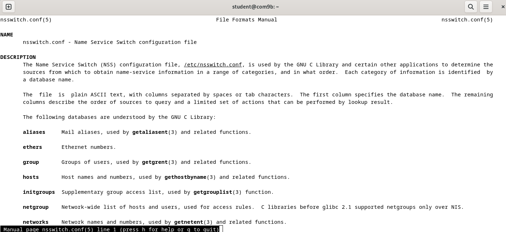
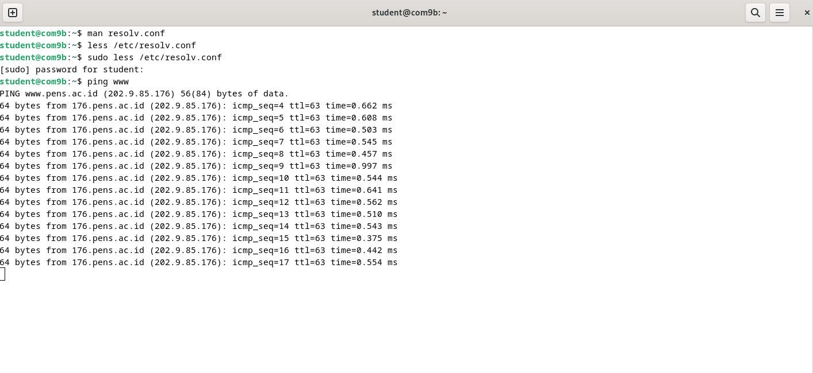

<div align="center">
  <h1 style="font-weight: bold"> LAPORAN PRAKTIKUM 4 WORKSHOP ADMINISTRASI JARINGAN <br> DNS dan Ekosistem Internet </h1>
  <h4 style="text-align: center;">Dosen Pengampu : Dr. Ferry Astika Saputra, S.T., M.Sc.</h4>
</div>
<br />
<br />
<div align="center">
  
  <h3 style="text-align: center;">Disusun Oleh : </h3>
  <p style="text-align: center;">
    Firsty Angelica Valency (3123500029)<br>
  </p>
  <h3 style="text-align: center;line-height: 1.5">Program Studi Teknik Informatika<br>Departemen Teknik Informatika Dan Komputer<br>Politeknik Elektronika Negeri Surabaya<br>2024/2025</h3>
  <hr>
</div>
 

# Daftar Isi

- [Daftar Isi](#daftar-isi)
- [A. Rangkuman Teori](#a-rangkuman-teori)
- [B. Percobaan](#b-percobaan)
- [C. Tugas :](#c-tugas-)
  - [Kerjakan instalasi dan konfigurasi bind9 yang ada di laman server-word no 1,2 dan 4](#kerjakan-instalasi-dan-konfigurasi-bind9-yang-ada-di-laman-server-wordno12dan4)
- [Kesimpulan](#kesimpulan)
   


---

# A. Rangkuman Teori 

- [Rangkuman DNS](DNS.md)
- [Rangkuman Ekosistem Internet](EKOSISTEMINTERNET.md)

- Cara Kerja DNS
  
  

  DNS bekerja dengan menerjemahkan nama domain ke alamat IP. Prosesnya dapat dijelaskan sebagai berikut:

1. Komputer client mengirim permintaan ke server DNS `192.168.1.53` untuk mencari informasi mengenai nama domain `www.example.com.au`.
2. `192.168.1.53` tidak memiliki informasi tersebut, permintaan diteruskan ke server root.
3. Server root memberi instruksi kepada `192.168.1.53` untuk menghubungi `a.b.c.d.`
4. `192.168.1.53` kemudian meneruskan permintaan pencarian ke `a.b.c.d.`
5. Karena `a.b.c.d` hanya mengetahui domain `.au,` server mengarahkan `192.168.1.53` ke `i.j.k.l.`
6. `192.168.1.53` melanjutkan pencarian dengan menghubungi `e.f.g.h.`
7. `e.f.g.h` hanya mengetahui domain .com.au, server ini menginstruksikan `192.168.1.53` untuk bertanya ke `i.j.k.l.`
8. `192.168.1.53` kemudian meminta informasi domain kepada `i.j.k.l.`
9. `i.j.k.l` mengenali domain `example.com.au` dan mengembalikan informasi alamatnya ke `192.168.1.53.`
10. `192.168.1.53` meneruskan hasil pencarian tersebut kepada komputer client `192.168.1.100.`
11. Setelah seluruh proses selesai, client kini dapat mengakses `www.example.com.au`, yang berada di alamat `m.n.o.p.`

---

# B. Percobaan

1. Cek IP address
   
    

    IP Address saya adalah `10.252.108.126`

2. Buka File `/etc/bind/nsswitch.conf`
   
   Fungsinya apa?

   Untuk melihat fungsi dari file `/etc/bind/nsswitch.conf` dapat menggunakan perintah `man nsswitch.conf`

   

    File `/etc/nsswitch.conf` mengatur urutan pencarian sistem saat mencari informasi, termasuk nama domain.  
    
   - **Menentukan urutan pencarian nama host**  
       - Contoh aturan:  
        ```bash
        hosts: files dns
        ```
    - Sistem akan:
      1. **Mengecek `/etc/hosts`** terlebih dahulu.  
      2. Jika tidak ditemukan, **baru mencari ke DNS** yang diatur di `/etc/resolv.conf`.  

   - **Mengontrol sumber data lain**  
       - Selain hostname, file ini juga mengatur pencarian user dan grup.  
       - Contoh:
            ```bash
            passwd: files ldap
            group: files ldap
            ```
       - Artinya:
      1. Cari data user/grup di file lokal (`/etc/passwd` & `/etc/group`).  
      2. Jika tidak ada, cari di **server LDAP**.  

    Jadi, **`nsswitch.conf` membantu sistem memilih sumber informasi yang benar sesuai urutan yang telah ditentukan.**

   

   berikut adalah isi dari file `/etc/bind/nsswitch.conf`
   
    

3. Ping PC alvany dengan IP address PC alvany `10.252.108.105`
   
   

   Percobaan ini dilakukan untuk memverifikasi koneksi antara PC dan server DNS menggunakan IP address `10.252.108.105`dan IP tersebut berhasil ditemukan.

4. Buka File `/etc/hosts`
   
   
   

   Berikut adalah isi dari file `/etc/hosts` dengan menambahkan IP address teman saya Alvany

   

   Tujuan dari percobaan ini adalah untuk memverifikasi koneksi antara PC dan server DNS tanpa menggunakan IP address `10.252.108.105` tetapi hanya dengan menggunakan nama domain Alvany (`ping Alvanyyy`)dengan menambahkan nama domain (host) ke file `/etc/hosts`. 

5. Uji koneksi dengan ping IP address Alvany
   
   

   Seperti yang ditampilkan di gambar, koneksi berhasil terjadi hanya dengan menggunakan nama domain (host) Alvany.

6. Buka File `/etc/resolv.conf`

    Fungsi dari `/etc/resolv.conf` dapat diketahui dengan melakukan perintah `man` dan akan muncul informasi dibawah ini:

    

    File `/etc/resolv.conf` digunakan oleh sistem operasi Linux untuk mengonfigurasi DNS (Domain Name System). File ini berisi informasi tentang server DNS yang digunakan untuk menerjemahkan nama domain (misalnya, google.com) menjadi alamat IP.

    Untuk melihat isi dari `/etc/resolv.conf` dapat menggunakan perintah `less /etc/resolv.conf`

    
   

    Berikut adalah isi dari `/etc/resolv.conf`

    

    1. `nameserver` → Menentukan alamat IP server DNS yang digunakan untuk melakukan pencarian domain.`8.8.8.8` dan `8.8.4.4 `adalah `DNS publik milik Google`.
    2. `search` → Menentukan domain default yang akan dicoba ditambahkan ke pencarian nama domain. Jika Anda mencoba mengakses server1, sistem akan mencoba server1.example.com terlebih dahulu.
    
7.  Mencoba ping `www`
   
    

    Bagaimana bisa ditemukan?
    
    File `/etc/resolv.conf` membantu sistem menemukan alamat IP dari sebuah nama domain.  

    - **`search pens.ac.id`**: Jika Anda mengetik `ping www`, sistem otomatis mencoba `ping www.pens.ac.id`.  
  
    - **`nameserver 202.9.85.4` dan `nameserver 202.9.85.3`**: Jika nama domain tidak ditemukan di lokal, sistem akan bertanya ke server DNS ini untuk mendapatkan alamat IP-nya.  

    Jadi, konfigurasi ini memastikan bahwa saat Anda mengetik nama pendek (`www`), sistem tetap bisa menemukan alamat lengkapnya (`www.pens.ac.id`).

8. Buka File Root Hints ` /usr/share/dns/root.hints`
   
   


   Berikut adalah isi dari file `/usr/share/dns/root.hints`

   

---   

# C. Tugas : 

## Kerjakan instalasi dan konfigurasi bind9 yang ada di laman server-word no 1,2 dan 4

BIND : Configure for Internal Network **Kelompok 3**
 	
**Install BIND to Configure DNS (Domain Name System) Server to provide Name or Address Resolution service for Clients.**

1.	Install BIND.

```bash
    root@dlp:~# apt -y install bind9 bind9utils
```


Menginstal bind9 (server DNS utama) dan bind9utils (alat bantu tambahan untuk konfigurasi DNS).

2. **On this example, Configure BIND for Internal Network.**
The example follows is for the case that Local network is [10.0.0.0/24], Domain name is [srv.world], Replace them to your own environment.

```bash  
        root@dlp:~# vi /etc/bind/named.conf
        include "/etc/bind/named.conf.options";
        include "/etc/bind/named.conf.local";
        include "/etc/bind/named.conf.default-zones";
        # add
        include "/etc/bind/named.conf.internal-zones";
```

Melakukan penambahan file `/etc/bind/named.conf.internal-zones`


Di langkah ini, kita akan mengonfigurasi BIND agar bekerja di jaringan internal 192.168.1.0/24 dengan domain srv.world. Jika menggunakan jaringan lain, sesuaikan dengan lingkungan yang digunakan.

```bash
    root@dlp:~# vi /etc/bind/named.conf.options
    # add : set ACL entry for local network
    acl internal-network {
            10.0.0.0/24;
    };

    options {
            directory "/var/cache/bind";

    .....
    .....

            # add local network set on [acl] section above
            # network range you allow to recieve queries from hosts
            allow-query { localhost; internal-network; };
            # network range you allow to transfer zone files to clients
            # add secondary DNS servers if it exist
            allow-transfer { localhost; };
            # add : allow recursion
            recursion yes;

            //=======================================================================
            // If BIND logs error messages about the root key being expired,
            // you will need to update your keys.  See https://www.isc.org/bind-keys
            //=======================================================================

            dnssec-validation auto;

            # if not listen IPV6, change [any] to [none]
            listen-on-v6 { any; };
    };

```


Atur hak akses untuk jaringan internal dengan cara 
edit file named.conf.options untuk mengatur siapa saja yang bisa mengakses DNS ini. 

```bash
        `allow-query { localhost; internal-network; };` # Hanya jaringan lokal yang boleh menggunakan DNS ini
        allow-transfer { localhost; };  # Hanya localhost yang boleh mentransfer zona
        recursion yes;  # Mengizinkan pencarian nama domain secara rekursif

        dnssec-validation auto;
        listen-on-v6 { any; };  # Jika tidak menggunakan IPv6, bisa diubah menjadi "none"
```


```bash
root@dlp:~# vi /etc/bind/named.conf.internal-zones
# create new
# add zones for your network and domain name
zone "srv.world" IN {
        type master;
        file "/etc/bind/srv.world.lan";
        allow-update { none; };
};
zone "0.0.10.in-addr.arpa" IN {
        type master;
        file "/etc/bind/0.0.10.db";
        allow-update { none; };
};

# if you don't use IPv6 and also suppress logs for IPv6 related, possible to change
# set BIND to use only IPv4
```


Kemudian kita buat file konfigurasi zona agar DNS dapat menerjemahkan nama domain ke alamat IP dan sebaliknya. Zona `kelompok3.home` digunakan untuk menerjemahkan nama domain → alamat IP
Zona "11.168.10.in-addr.arpa" digunakan untuk menerjemahkan alamat IP → nama domain (Reverse DNS)

```bash
root@dlp:~# vi /etc/default/named
# add
OPTIONS="-u bind -4"
# For how to write the section [*.*.*.*.in-addr.arpa], write your network address reversely like follows
# case of 10.0.0.0/24
# network address     ⇒ 10.0.0.0
# network range       ⇒ 10.0.0.0 - 10.0.0.255
# how to write        ⇒ 0.0.10.in-addr.arpa

# case of 192.168.1.0/24
# network address     ⇒ 192.168.1.0
# network range       ⇒ 192.168.1.0 - 192.168.1.255
# how to write        ⇒ 1.168.192.in-addr.arpa
```


Mengubah `file /etc/default/named` untuk memastikan BIND hanya berjalan di IPv4 (karena kita tidak menggunakan IPv6) dengan menambahkan opsi `-4` pada baris terakhir untuk memastikan server menerima permintaan DNS melalui IPv4 saja.

4. **Verify Resolution**
   
- Restart BIND to apply changes.
  
```bash
root@dlp:~# systemctl restart named
```


Setelah semua konfigurasi selesai, kita perlu me-restart layanan BIND agar perubahan disimpan.

- 	Change DNS setting to refer to own DNS if needed.
  
```bash
root@dlp:~# vi /etc/resolv.conf
# change nameserver
nameserver 10.0.0.30

# * if you are using resolvconf or Networkmanager programs,
# change nameserver setting on a file for their requirements
```


Agar server bisa menggunakan DNS yang sudah dikonfigurasi, kita perlu mengubah /etc/resolv.conf yang berarti semua permintaan DNS dari server ini akan dikirim ke 192.168.1.25 (server DNS kita).

- 	Verify Name and Address Resolution. If [ANSWER SECTION] is shown, that's OK.

```bash
root@dlp:~# dig dlp.srv.world.

; <<>> DiG 9.18.12-1-Debian <<>> dlp.srv.world.
;; global options: +cmd
;; Got answer:
;; ->>HEADER<<- opcode: QUERY, status: NOERROR, id: 34251
;; flags: qr aa rd ra; QUERY: 1, ANSWER: 1, AUTHORITY: 0, ADDITIONAL: 1

;; OPT PSEUDOSECTION:
; EDNS: version: 0, flags:; udp: 1232
; COOKIE: 399a23023b136d3901000000648a68aaab63310525a6459f (good)
;; QUESTION SECTION:
;dlp.srv.world.                 IN      A

;; ANSWER SECTION:
dlp.srv.world.          86400   IN      A       10.0.0.30

;; Query time: 0 msec
;; SERVER: 10.0.0.30#53(10.0.0.30) (UDP)
;; WHEN: Wed Jun 14 20:26:02 CDT 2023
;; MSG SIZE  rcvd: 86
```


Cek Resolusi Nama Domain ke IP
Gunakan perintah dig untuk memastikan DNS dapat menerjemahkan nama domain ke IP. Jika hasilnya adalah [ANSWER SECTION] yang ditampilkan, maka DNS berhasil.

```bash
root@dlp:~# dig -x 10.0.0.30

; <<>> DiG 9.18.12-1-Debian <<>> -x 10.0.0.30
;; global options: +cmd
;; Got answer:
;; ->>HEADER<<- opcode: QUERY, status: NOERROR, id: 44135
;; flags: qr aa rd ra; QUERY: 1, ANSWER: 1, AUTHORITY: 0, ADDITIONAL: 1

;; OPT PSEUDOSECTION:
; EDNS: version: 0, flags:; udp: 1232
; COOKIE: 1091197ede0eca9001000000648a68cf698db831ee837680 (good)
;; QUESTION SECTION:
;30.0.0.10.in-addr.arpa.                IN      PTR

;; ANSWER SECTION:
30.0.0.10.in-addr.arpa. 86400   IN      PTR     dlp.srv.world.

;; Query time: 0 msec
;; SERVER: 10.0.0.30#53(10.0.0.30) (UDP)
;; WHEN: Wed Jun 14 20:26:39 CDT 2023
;; MSG SIZE  rcvd: 106
```


Cek Reverse DNS (IP ke Nama Domain) untuk memeriksa apakah DNS bisa menerjemahkan alamat IP ke nama domain dan berdasarkan hasilnya, kita bisa mengetahui apakah DNS berfungsi dengan benar karena tidak muncul [ANSWER SECTION].

# Kesimpulan

Pada Praktikum ini, kita belajar tentang konfigurasi DNS untuk menyediakan layanan nama domain (DNS) untuk jaringan internal. Kita menggunakan BIND sebagai server DNS dan mengaturnya untuk menerima permintaan DNS dari jaringan internal 192.168.1.0/24 dengan domain kelompok3.home. Selain itu, kita juga mengatur BIND untuk mengizinkan pengguna lokal untuk mengakses DNS ini. Setelah konfigurasi, kita perlu me-restart layanan DNS agar perubahan disimpan.
