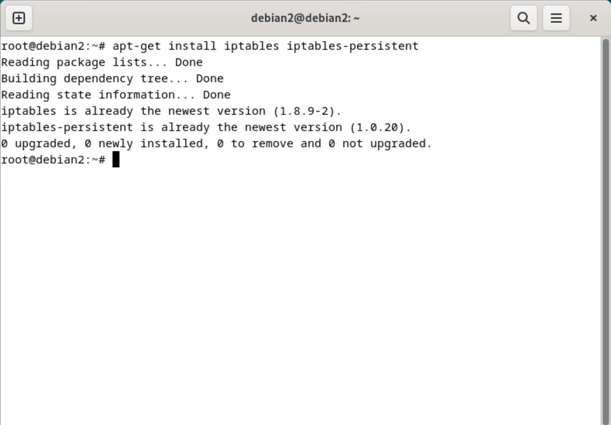

<div align="center">
  <h1 style="font-weight: bold"> LAPORAN PRAKTIKUM 6 WORKSHOP ADMINISTRASI JARINGAN <br> INTERNAL NETWORK 2 VM </h1>
  <h4 style="text-align: center;">Dosen Pengampu : Dr. Ferry Astika Saputra, S.T., M.Sc.</h4>
</div>
<br />
<br />
<div align="center">
  
  <h3 style="text-align: center;">Disusun Oleh : </h3>
  <p style="text-align: center;">
    Firsty Angelica Valency (3123500029)<br>
  </p>
  <h3 style="text-align: center;line-height: 1.5">Program Studi Teknik Informatika<br>Departemen Teknik Informatika Dan Komputer<br>Politeknik Elektronika Negeri Surabaya<br>2024/2025</h3>
  <hr>
</div>
 

# Daftar Isi

- [Daftar Isi](#daftar-isi)
- [TUGAS](#tugas)
- [A. Konfigurasi VM 1 dan 2](#a-konfigurasi-vm-1-dan-2)
  - [A.1 Konfigurasi IP VM 1](#a1-konfigurasi-ip-vm-1)
- [B. Konfigurasi NTPSec pada VM 1](#b-konfigurasi-ntpsec-pada-vm-1)
- [C. Konfigurasi File Samba pada VM 1](#c-konfigurasi-file-samba-pada-vm-1)
- [D. Konfigurasi DNS Server pada VM 1](#d-konfigurasi-dns-server-pada-vm-1)
- [E. Melakukan Konfigurasi Network pada VM 2 dengan Internal Network](#e-melakukan-konfigurasi-network-pada-vm-2-dengan-internal-network)
- [KESIMPULAN](#kesimpulan)
   


---
# TUGAS
1. Memiliki `2 VM` 
2. `VM 1` akan bertindak sebagai `server` dan dikonfigurasi dengan dua adapter jaringan. 
   - `Adapter pertama` menggunakan `Bridge Adapter` agar bisa terhubung ke internet dengan Bridge Adapter.
   - `Adapter kedua` memakai `Internal Network` untuk komunikasi langsung dengan VM client. Server ini juga berfungsi sebagai gateway, yaitu penghubung antara client dan internet. Selain itu, server dilengkapi layanan seperti Samba untuk berbagi file, NTPSec untuk sinkronisasi waktu, dan Bind9 untuk mengelola domain lokal.
  
3. `VM 2` akan bertindak sebagai `client` dan dikonfigurasi dengan dua adapter jaringan dimana networknya adalah internal network.
---

# A. Konfigurasi VM 1 dan 2

## A.1 Konfigurasi IP VM 1 

Membuat VM 1 dengan setting 1 network internal dan 1 network public (Bridge Adapter)

- Bridge Adapter

    

- Internal network

    

- Melakukan Konfigurasi network pada VM 2 dengan Internal Network

    

    Konfigurasi ini bertujuan supaya VM 2 mendapatkan alamat IP dari VM 1. 

- Akses terminal VM 1 menggunakan SSH

  Masuk di terminal VM 1 dengan cara mengetik `ssh debian2@192.168.3.1` di terminal dan masukkan password `debian2`

  


- Ketik `nano /etc/network/interfaces` untuk membuka file      konfigurasi network pada VM 1
  
    

- kemudian, tambahkan baris berikut

    ```bash
        auto eth0
        iface eth0 inet static
        address 192.168.3.1
        netmask 255.255.255.0
        broadcast 192.168.3.255
        dns-nameservers 1.1.1.1
    ```

    

- Lalu kita restart layanan network untuk menerapkan perubahan
    
    ```bash
    root@dlp:~# systemctl restart networking
    ```

    


- Cek IP address VM 1 dengan cara mengetik `ip a` di terminal

    


- Aktifkan forwarding di Server

    ```bash
        root@dlp:~# vi /etc/sysctl.conf
        # Forwarding
        net.ipv4.ip_forward=1
    ```

    

    

    Untuk membuat sistem berfungsi sebagai router atau gateway, konfigurasi IP forwarding harus diaktifkan. Langkah ini dilakukan dengan mengedit file konfigurasi dan mengaktifkan opsi `net.ipv4.ip_forward.`
     
    

- Konfigurasi Iptables dan Iptables-persistent
  
  Langkah pertama adalah install paket Iptables dan Iptables-persistent dengan cara mengetik `apt install iptables iptables-persistent` di terminal.

  

  Setelah itu kita melakukan konfigurasi untuk mengaktifkan iptables dan iptables-persistent

  

  Terakhir, kita menjalankan perintah `iptables-restore < /etc/iptables/rules.v4`untuk menyimpan konfigurasi iptables

  

---

# B. Konfigurasi NTPSec pada VM 1

- Melakukan installasi paket NTPSec pada VM 1 dengan cara mengetik `apt install ntpsec` di terminal
  
  

- Konfigurasi server NTP
  
  

- Restart NTPSec dengan cara mengetik `systemctl restart ntpsec` di terminal
  
  

- Cek status NTPSec dengan cara mengetik `systemctl status ntpsec` di terminal

    

    Seperti yang ditampilkan di gambar, NTPSec memiliki status `active (running)`.

- Valid NTP Server dengan cara mengetik `ntpq -p` di terminal

    

    Seperti yang ditampilkan di gambar, NTP Server sudah berhasil valid.

--- 
# C. Konfigurasi File Samba pada VM 1

- Melakukan instalasi paket Samba dengan cara mengetik `apt install samba` di terminal
  
  

- Membuat direktori `/home/share` dan `/home/share2` dengan cara mengetik `mkdir /home/share /home/share2` di terminal dan mengubah izin aksesnya dengan cara mengetik `chmod 777 /home/share /home/share2` di terminal supaya bisa diakses oleh semua user
  
  

- Konfigurasi file `/etc/samba/smb.conf` dengan cara mengetik `nano /etc/samba/smb.conf` di terminal

  Tambahkan baris berikut

    ```bash
        [Share]
        path = /home/share2
        read only = no
        guest ok = yes
        create mask = 0777
        directory mask = 0777
    ```

    

- restart layanan samba dengan cara mengetik `systemctl restart smbd` di terminal

    

---
# D. Konfigurasi DNS Server pada VM 1

- Melakukan instalasi paket Bind9 dengan cara mengetik `apt install bind9` di terminal
  
  

- Konfigurasi file `/etc/bind/named.conf.options` dengan cara mengetik `nano /etc/bind/named.conf.options` di terminal dan menambahkan `include "/etc/bind/named.conf.internal-zones";` di baris terakhir

    

- Modifikasi file `/etc/bind/named.conf.internal-zones` dengan cara mengetik `nano /etc/bind/named.conf.internal-zones` di terminal
  
    

- Menambahkan `acl internal-network ` di baris pertama file `/etc/bind/named.conf.Options`

    

- Modifikasi file `/etc/default/named` dengan menambahkan `-4`

    

- Membuat file dengan domain lokal dalam kasus ini adalah kelompok3.home
  
  

- Membuat File db dengan domain lokal dalam kasus ini adalah kelompok3.home

  
  

---

# E. Melakukan Konfigurasi Network pada VM 2 dengan Internal Network


- Melakukan Ping ke VM 1 dengan cara mengetik `ping 192.168.3.1` di terminal
  
    

    Berdasarkan hasilnya, ping ke VM 1 berhasil.
  
- Cek IP pada VM 2 dengan cara mengetik `ip a` di terminal
  
    

    Informasi tersebut menunjukkan bahwa VM 2 tidak bisa mendapatkan alamat IP dari VM 1. Untuk mengatasi masalah ini, kita perlu mengubah setting IP VM 2 menjadi DHCP.

    ```bash
        root@dlp:~# vi /etc/network/interfaces
    ```

    

- Untuk mengubah setting IP VM 2 menjadi DHCP, kita menghapus baris `iface eth0 inet static` dan menambahkan baris berikut

    ``` bash
        auto eth0
        iface eth0 inet dhcp
                address 192.168.3.10
                netmask 255.255.255.0
                broadcast 192.168.3.1 
                dns-nameservers 1.1.1.1
    ```

    

    Setelah itu, kita restart layanan network untuk menerapkan perubahan

    ```bash
    root@dlp:~# systemctl restart networking
    ```

    

    Kemudian kita coba cek lagi IP address VM 2 dengan cara mengetik `ip a` di terminal

    

    Berdasarkan hasilnya, VM 2 bisa mendapatkan alamat IP dari VM 1 yaitu `192.168.3.10`.

- Mencoba ping domain lokal ke VM 2 dengan cara mengetik `ping kelompok3.home` di terminal

    

    Berdasarkan hasilnya, ping ke domain lokal berhasil.
- Mencoba ping 1.1.1.1 yang merupakan server dari DNS
  
    

    Berdasarkan hasilnya, ping ke server DNS berhasil.

- Mencoba mengakses file lokal ke VM 2 dengan cara mengetik `ls /home/share2` di terminal

    

    Kemudian kita klik directory share 

    

    Karena file sharing dibuat unlimited, maka kita bisa mengakses semua file di folder share tanpa perlu login dengan password. Jika folder Share sudah muncul di tampilan file manager client seperti yang terlihat pada gambar, artinya konfigurasi Samba di server sudah berjalan dengan benar dan client berhasil mengakses resource sharing yang disediakan oleh server.

    

    Berdasarkan hasilnya, file lokal berhasil di akses.

- Cek DNS Server (Client) menggunakan nama domain
  
    

    Berdasarkan hasilnya, DNS Server (Client) berhasil menemukan nama domain tanpa ada error dan tersolve ke IP `192.168.3.1` artinya client bisa mengakses server lokal dengan menggunakan nama domain.

- Cek DNS Server (Server) menggunakan IP address
  
    

    Berdasarkan hasilnya, DNS Server (Server) berhasil menemukan nama domain tanpa ada error dan tersolve ke IP `192.168.3.1` artinya server bisa mengakses client lokal dengan menggunakan nama domain.

---

# KESIMPULAN

Dalam praktikum ini, saya berhasil mengkonfigurasi dua Virtual Machine, yaitu VM1 sebagai server dan VM2 sebagai client. Saya mengatur server dengan dua adapter jaringan (Bridged Adapter dan Internal Network), kemudian mengaktifkan fitur IP forwarding agar server dapat berfungsi sebagai gateway. Saya juga memberikan IP statis pada masing-masing VM dalam jaringan yang sama agar keduanya dapat saling terhubung. Selain itu, saya menggunakan SSH untuk mengakses server dari client secara remote. Praktikum ini membantu saya memahami cara membangun koneksi jaringan lokal serta mengelola komunikasi antar perangkat virtual secara langsung.