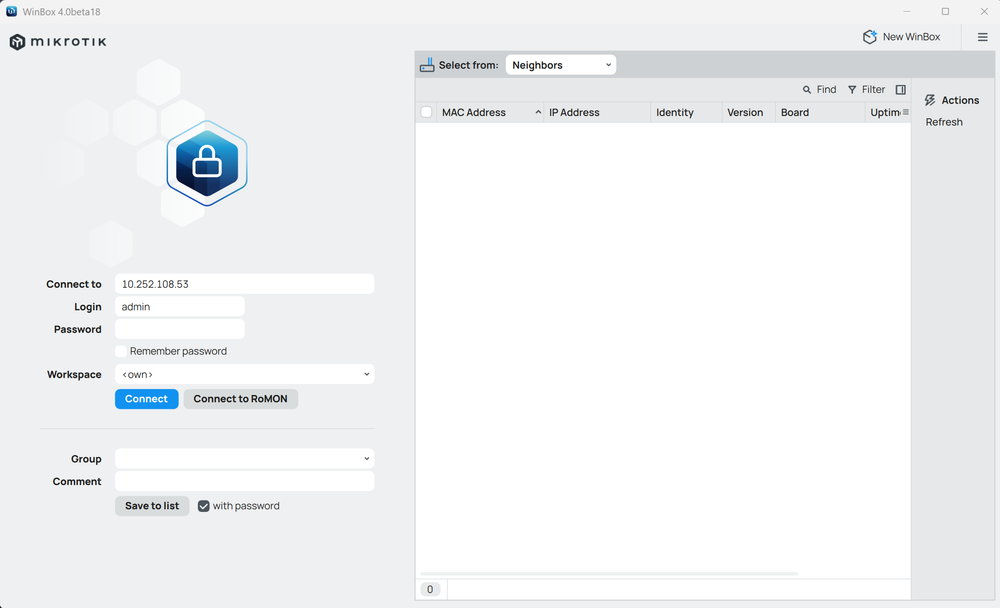

  <h1 style="font-weight: bold"> LAPORAN PRAKTIKUM WORKSHOP ADMINISTRASI JARINGAN</h1>
   <h1 style="font-weight: bold"> MIKROTIK </h1>
  <h4 style="text-align: center;">Dosen Pengampu : Dr. Ferry Astika Saputra, S.T., M.Sc.</h4>

 
 

  
  <h3 style="text-align: center;">Disusun Oleh : </h3>
  

    Firsty Angelica Valency (3123500029) 
  

  <h3 style="text-align: center;line-height: 1.5">Program Studi Teknik Informatika Departemen Teknik Informatika Dan Komputer Politeknik Elektronika Negeri Surabaya 2024/2025</h3>
  

# Daftar Isi
- [Daftar Isi](#daftar-isi)
- [TUGAS](#tugas)
- [HASIL PERCOBAAN](#hasil-percobaan)

---

# TUGAS

1. Installasi Winbox 
2. Konfigurasi Layer Network
   Percobaan pertama yang perlu dilakukan berdasarkan skema di atas adalah menghubungkan perangkat MikroTik antar kelompok. Tujuannya agar masing-masing laptop yang terhubung ke LAN dapat melakukan ping ke IP kelompok lain.Untuk melakukan hal tersebut, salah satu laptop dari setiap kelompok harus tersambung ke jaringan LAN dan melakukan pengujian dengan perintah ping.Dalam percobaan ini, digunakan alamat IP 10.252.108.5x, di mana x merupakan nomor kelompok. Karena kelompok saya adalah kelompok 4, maka IP MikroTik yang terhubung ke kelompok saya adalah 10.252.108.54.Setelah perangkat terhubung ke jaringan LAN melalui kabel, dapat melakukan ping ke IP lainnya menggunakan Command Prompt di Windows.
3. Ping Device kelompok lain sesuai networknya
   
# HASIL PERCOBAAN

- Install Wine
  

Installasi ini diperlukan agar bisa melakukan installaplikasi Winbox di Linux. Kemudian, instalasi ini akan menginstal Wine, yang merupakan sebuah emulator untuk Windows. Wine ini digunakan untuk membuat aplikasi yang dibuat untuk Windows, dapat dijalankan di Linux. 

- Install Winbox dengan sftp kelompok 5 
  

- Mencoba ping network 10.252.108.53
  

Berdasarkan hasil di atas network kelompok 3 ditemukan ketika menghubung di LAN dengan IP network 10.252.108.53.

- Connect Winbox ke Mikrotik dengan IP 10.252.108.53
  
\

- Mencoba ping network 192.168.1.0/24 di Mikrotik (Kelompok 1)
  

  
Pada bagian IP pilih Routes lalu masukkan network 192.168.1.0/24 dan masukkan gateway 10.252.108.51 (Pada gambar diatas adalah case untuk kelompok 7). Setelah itu, klik Save dan restart Winbox. Hidden apabila terdapat IP yang tidak terhubung ke Mikrotik. Lalu, coba ping ke IP 10.252.108.51 di command prompt. Sebagai contoh dibawah ini adalah hasil dari ping ke IP 192.169.1.0.
  

Jika test ping seperti di atas sudah berhasil, dan apabila ada status dari setiap test ping kosong, maka koneksi antar device beda kelompok sudah berhasil dilakukan. 

