<div align="center">
  <h1 style="font-weight: bold"> LAPORAN PRAKTIKUM WORKSHOP ADMINISTRASI JARINGAN</h1>
   <h1 style="font-weight: bold"> TOPOLOGI JARINGAN DAN .. </h1>
  <h4 style="text-align: center;">Dosen Pengampu : Dr. Ferry Astika Saputra, S.T., M.Sc.</h4>
</div>
<br />
<br />
<div align="center">
  
  <h3 style="text-align: center;">Disusun Oleh : </h3>
  <p style="text-align: center;">
    Firsty Angelica Valency (3123500029)<br>
  </p>
  <h3 style="text-align: center;line-height: 1.5">Program Studi Teknik Informatika<br>Departemen Teknik Informatika Dan Komputer<br>Politeknik Elektronika Negeri Surabaya<br>2024/2025</h3>
  <hr>
</div>

# Daftar Isi

- [Daftar Isi](#daftar-isi)
- [TUGAS](#tugas)
- [Percobaan](#percobaan)
  - [A. Mengubah IP sesuai dengan IP Kelompok](#a-mengubah-ip-sesuai-dengan-ip-kelompok)
  - [B. Konfigurasi Jaringan Internal](#b-konfigurasi-jaringan-internal)
    - [Konfigurasi Zone File](#konfigurasi-zone-file)
    - [Konfigurasi DNS Client untuk menggunakan DNS Server sendiri](#konfigurasi-dns-client-untuk-menggunakan-dns-server-sendiri)
    - [DNS Query menggunakan DiG (Domain Information Groper) untuk Forward Lookup.](#dns-query-menggunakan-dig-domain-information-groper-untuk-forward-lookup)
- [C. Konfigurasi Web Server](#c-konfigurasi-web-server)
    - [Instalasi Apache2](#instalasi-apache2)
    - [Konfigurasi Apache2](#konfigurasi-apache2)


# TUGAS
 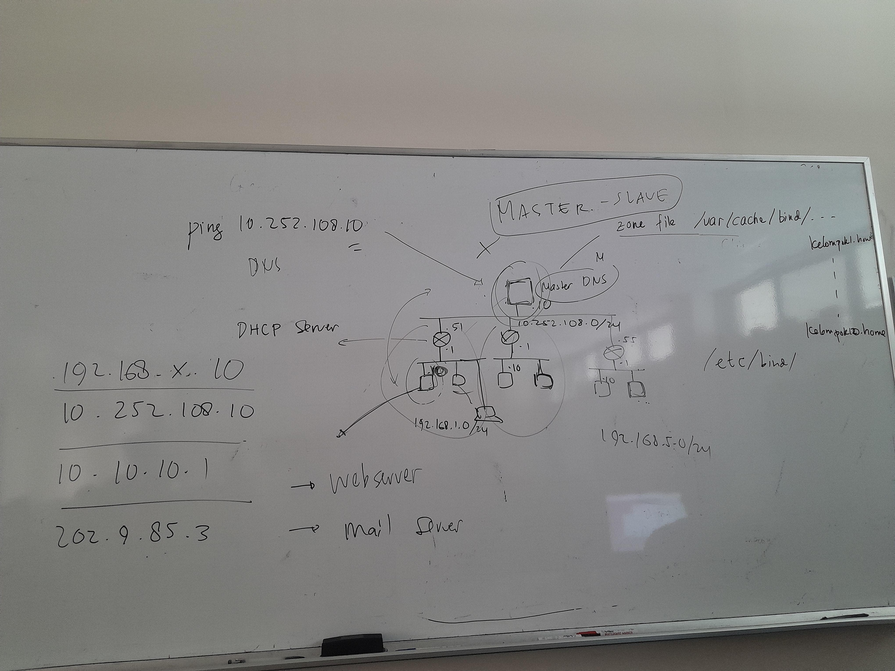

 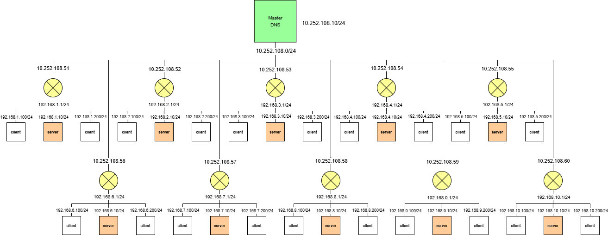

# Percobaan

## A. Mengubah IP sesuai dengan IP Kelompok

- Masuk di bagian Settings > Network > IPv4 > IPv4 Address
  
    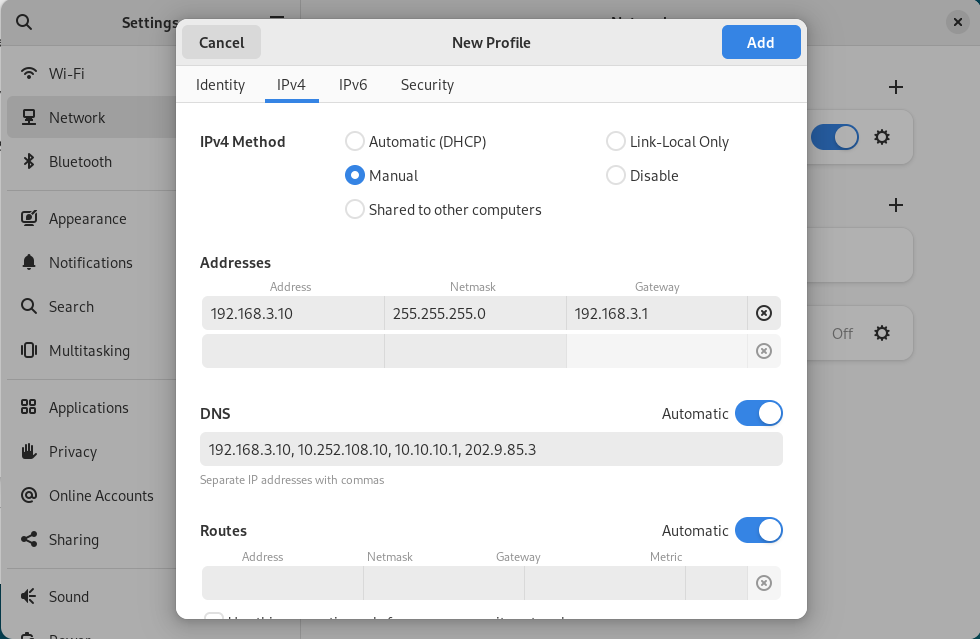

    Pada bagian ini, kita akan melakukan setting IPv4 secara static dengan memilih opsi manual agar bisa mengubah IP sesuai dengan IP Kelompok. `IP Server` adalah `192.168.3.10/24` dengan nomor kelompok 3 dan `IP Gateway` adalah `192.168.3.1`. `Netmask` nya adalah `/24`. Lalu kita juga mengisi `DNS` dengan `IP 192.168.3.10`(IP DHCP client), `10.252.108.10`(Master DNS) dan `10.10.10.1` (web server) dan `202.9.85.2` (mail server)

    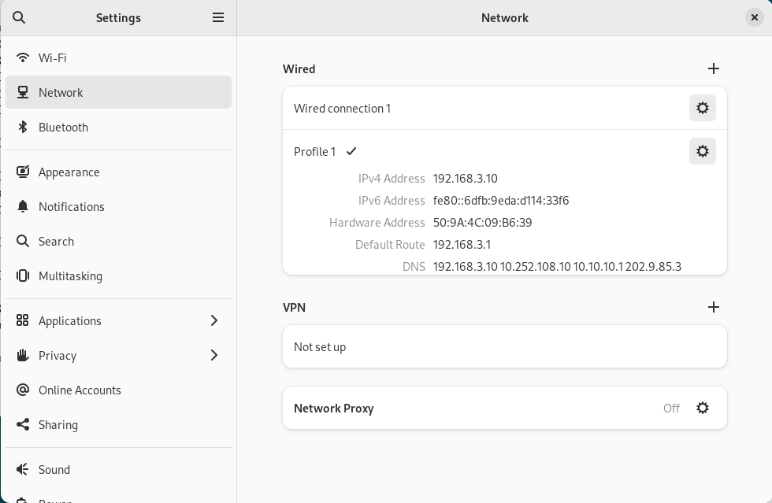

    Jika sudah berhasil akan muncul detail seperti gambar diatas.

- Cek IP yang telah di set dengan `ip -a`
    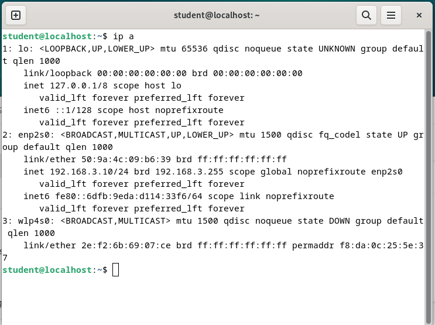

    Berdasarkan hasilnya, IP dari client sudah sesuai yaitu `192.168.3.10` 

-  Ping IP Master DNS  
    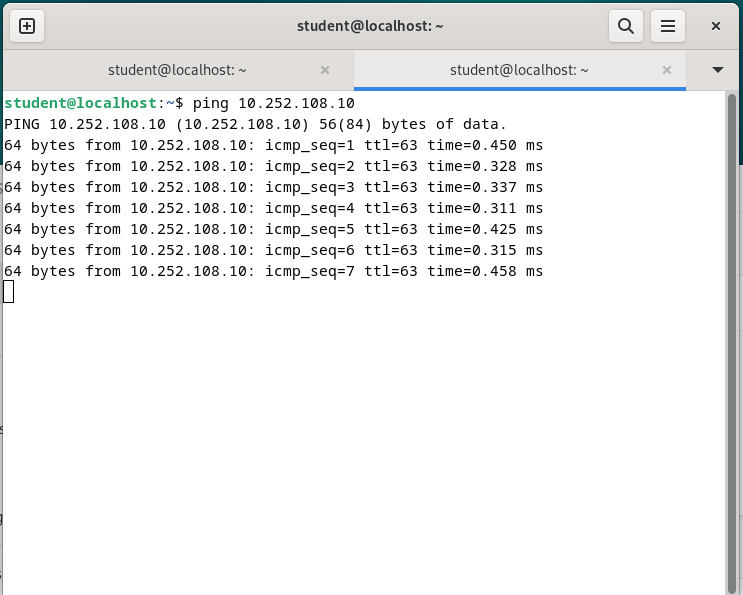

    Berdasarkan hasilnya, berhasil terhubung ke master DNS.

- Update Package 
  
    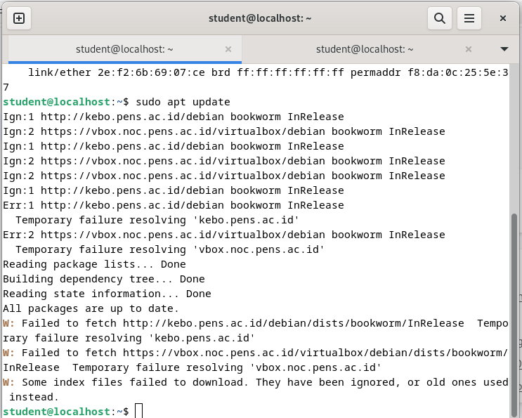

    Ketika hendak melakukan update package, akan error seperti gambar diatas karena masih belum terhubung ke internet. Hal ini juga bisa diatasi karena masalah setting IP yang seharusnya didapat dari IP Kelompok. Oleh karena itu, kita sebaiknya melakukan setting d `ietc/network/interfaces`

    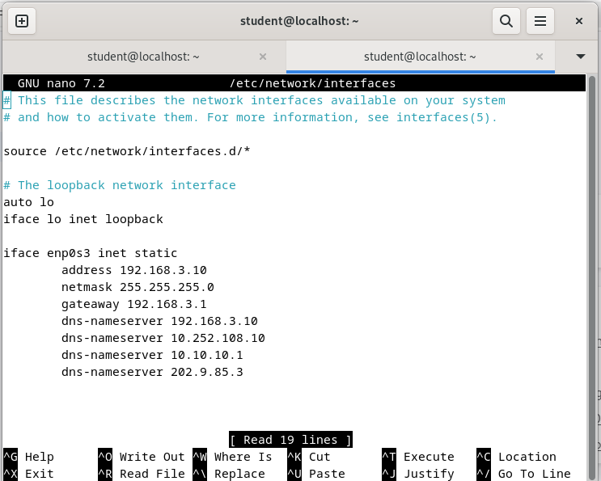

    Pada bagian ini, kita akan melakukan setting IPv4 secara static lalu mengubah IP sesuai dengan Net Kelompok yaitu 192.168.3.10/24 dengan nomor kelompok 3 dan `192.168.3.0`.

    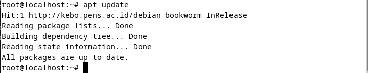

    Setelah itu, lakukan `apt update` sebagai root. Update berhasil dilakukan.

## B. Konfigurasi Jaringan Internal
    
-  Installasi BIND
  
    Masuk sebagai root lalu install BIND dengan perintah berikut.
    ``` bash
       root@dlp:~# apt -y install bind9 bind9utils
    ```
    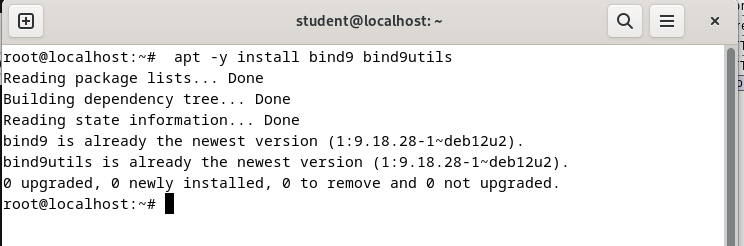

    Setelah itu masuk di `/etc/bind/named.conf` untuk menambahkan internal-zone.

    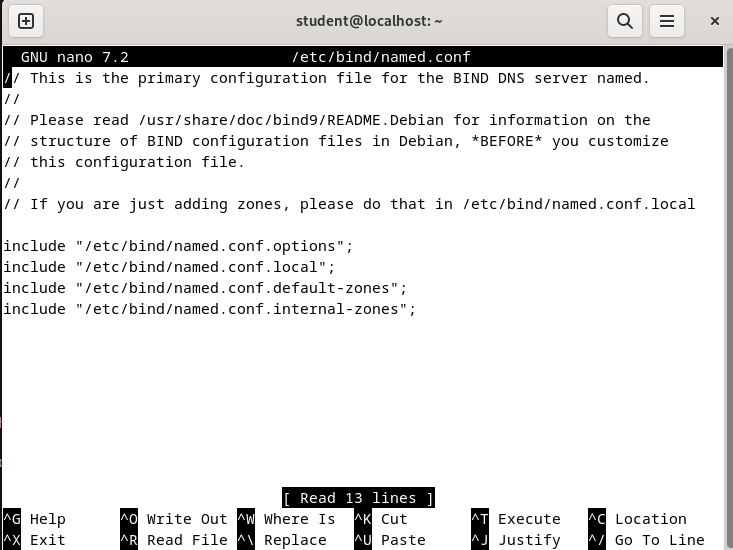

    Lalu, edit file `/etc/bind/named.conf.local`  pada bagian acl internal-network dengan network kelompok yaitu `192.168.3.0/24` .

     ```bash 
        root@dlp:~# nano /etc/bind/named.conf.options
        acl internal-network {
            192.168.3.0/24;
        };
    ```

    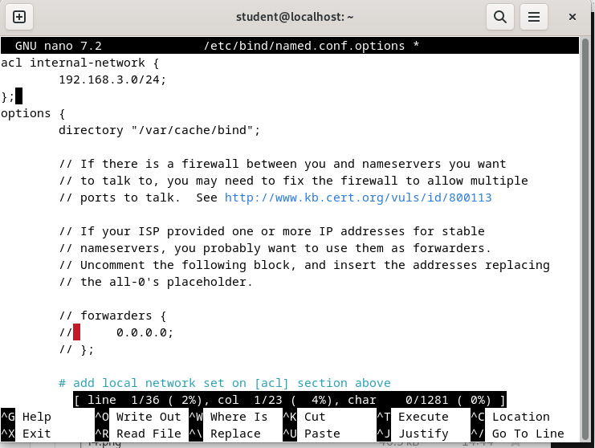

    Tambahkan nama domain dan zona network kelompok 3 dengan perintah berikut.

    ```bash 
        root@dlp:~# nano /etc/bind/named.conf.internal-zones
        zone "kelompok3.home" IN {
            type master;
            file "/etc/bind/db.kelompok3.home";
            allow-update { none; };
        };
        
        zone "3.168.192.in-addr.arpa" IN {
            type master;
            file "/etc/bind/3.168.192.db";
            allow-update { none; };
        };
    
    ```
    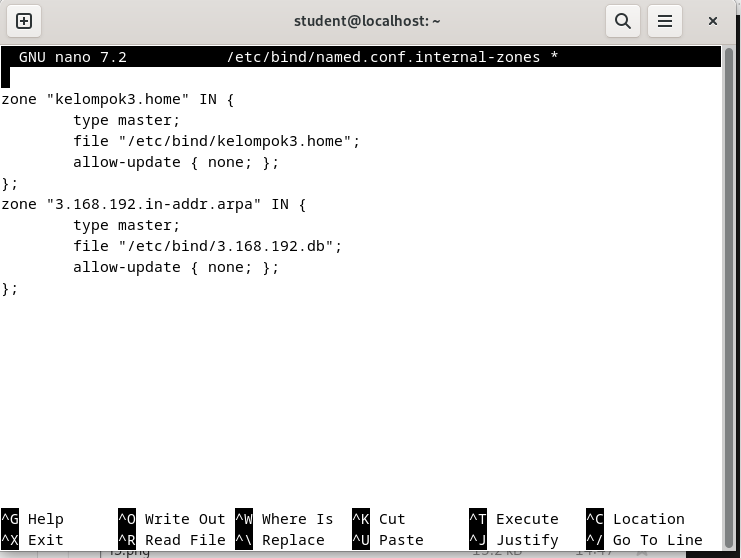

    Kemudian masuk di `/etc/bind/named` untuk menambahkan OPTIONS="-u bind -4"  yang menginstruksikan BIND untuk hanya menggunakan IPv4 dan mengabaikan IPv6 dan jaringan kita  hanya menggunakan IPv4 dan ingin menghindari log error terkait IPv6.

    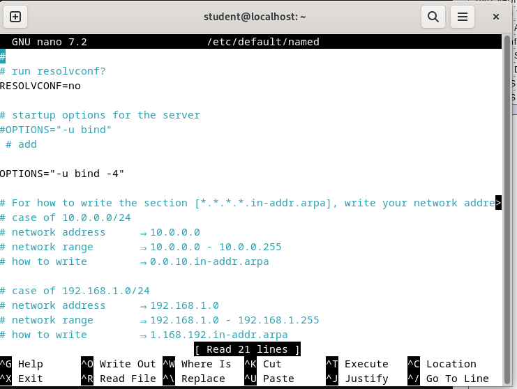

### Konfigurasi Zone File
  
Untuk konfigurasi zone file, masuk di `/etc/bind/db.kelompok3.home` dan `/etc/bind/3.168.192.db` lalu edit dengan perintah berikut.

- `/etc/bind/db.kelompok3.home`
  
    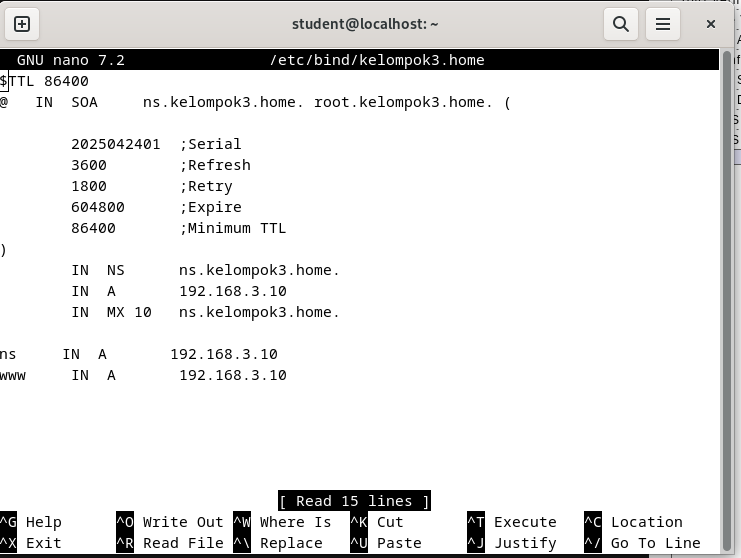

- `/etc/bind/3.168.192.db`
  
    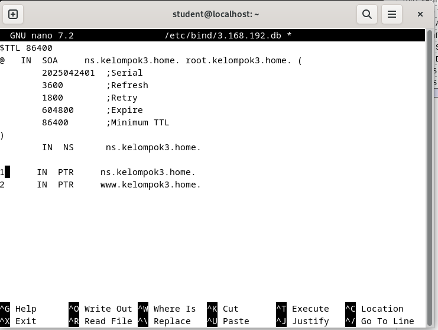

- restart bind dengan perintah `systemctl restart named`
  
### Konfigurasi DNS Client untuk menggunakan DNS Server sendiri
    
- Edit file `/etc/resolv.conf` dengan perintah berikut.
  
    ```    bash
    root@dlp:~# nano /etc/resolv.conf
        nameserver 192.168.3.10
        nameserver 10.252.108.10
        nameserver 10.10.10.1
        nameserver 202.9.85.2
    
    ``` 
    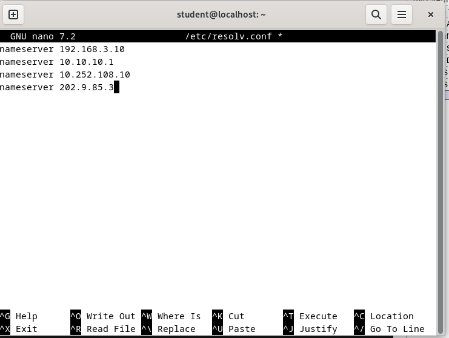

-  Restart DNS client dengan perintah `systemctl restart networking`

    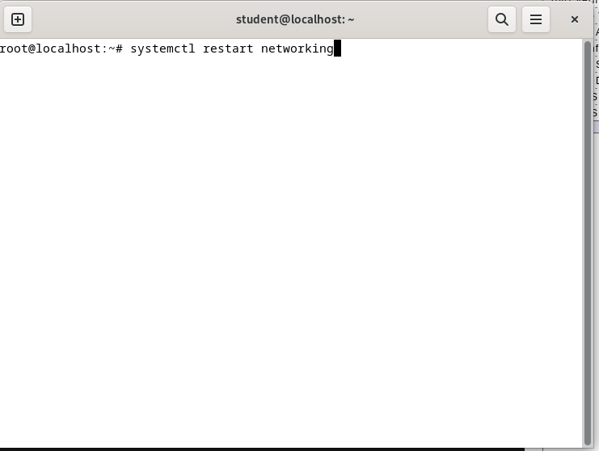

- Menambahkan DNS server untuk menjalankan query DNS pada file `/etc/bind/resolv.conf`
  
    
    
### DNS Query menggunakan DiG (Domain Information Groper) untuk Forward Lookup.

- Testing dengan cara mencari nama domain (hostname) berdasarkan alamat IP.  
  
    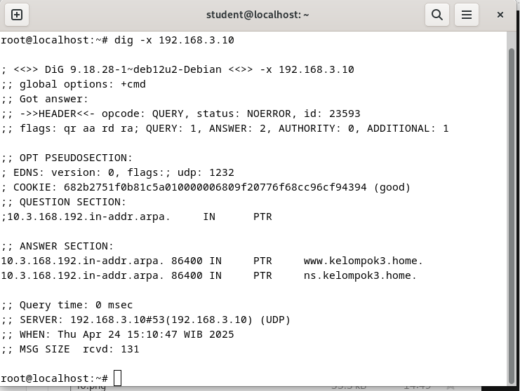

    `IP Address 192.168.3.10` terdaftar sebagai host untuk layanan `web (www)` dan `nameserver (ns)` dari domain lokal `kelompok3.home`.

- Testing dengan cara mencari alamat IP dari nama domain (hostname).  
  
    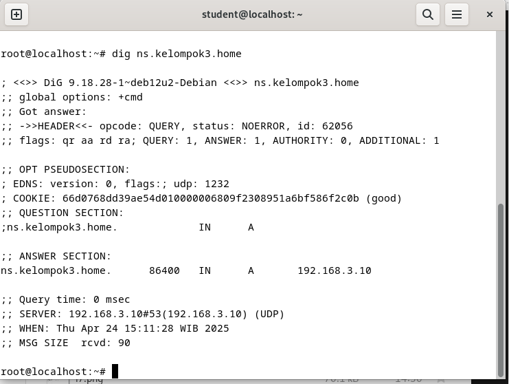

    Perintah `dig ns.kelompok3.home` menunjukkan bahwa nama domain `ns.kelompok3.home` telah terdaftar di server DNS dan berhasil dipetakan ke alamat IP `192.168.3.10`, yang menandakan bahwa DNS server berfungsi dengan baik.

# C. Konfigurasi Web Server

###  Instalasi Apache2
  
- Masuk sebagai root lalu install Apache dengan perintah berikut.

    ``` bash
        root@dlp:~# apt -y install apache2
    ```
  
    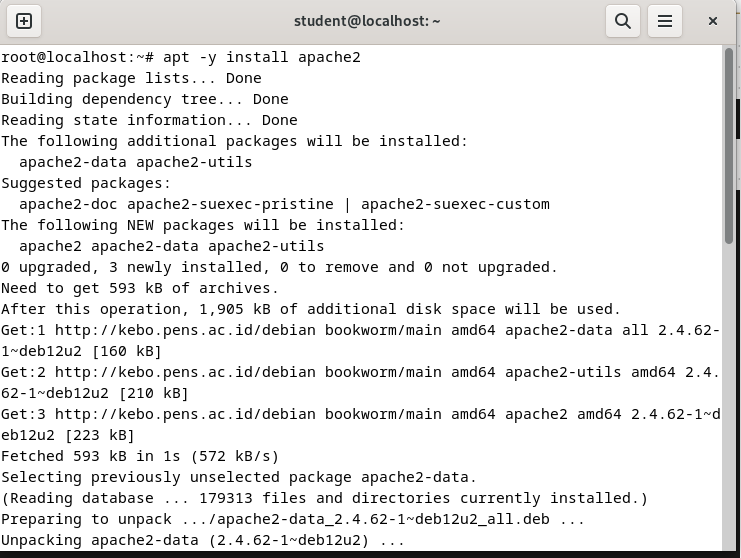

### Konfigurasi Apache2

- Konfigurasi security 
  
    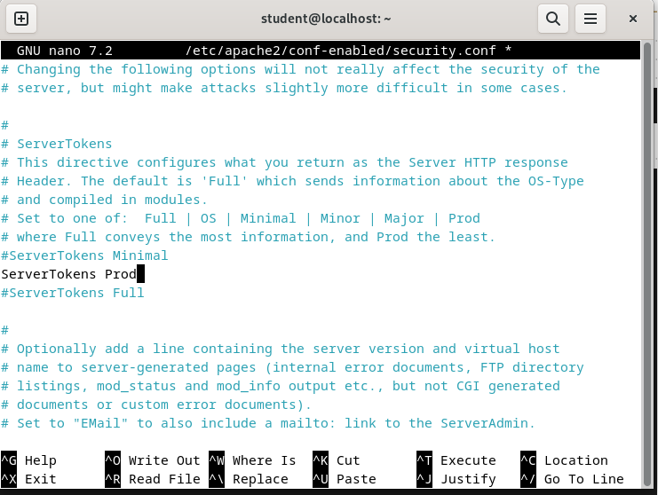

- Konfigurasi directory index 
  
    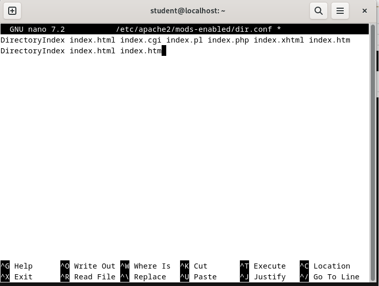

- Konfigurasi server name 
  
    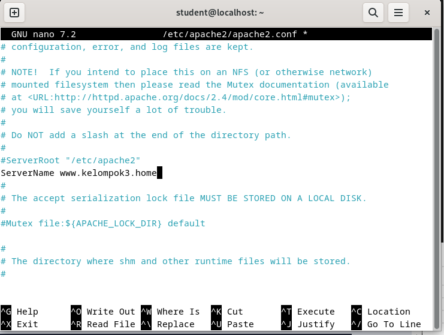

- Konfigurasi Email Administrator 
  
    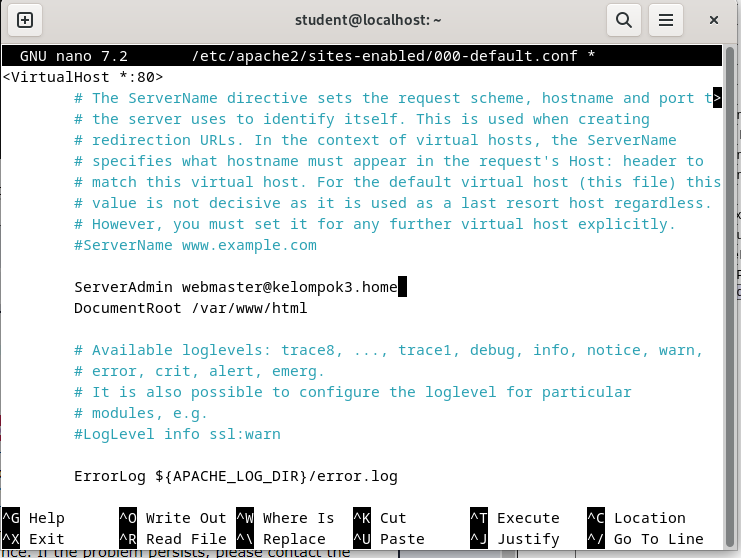

- Restart Apache2
    
    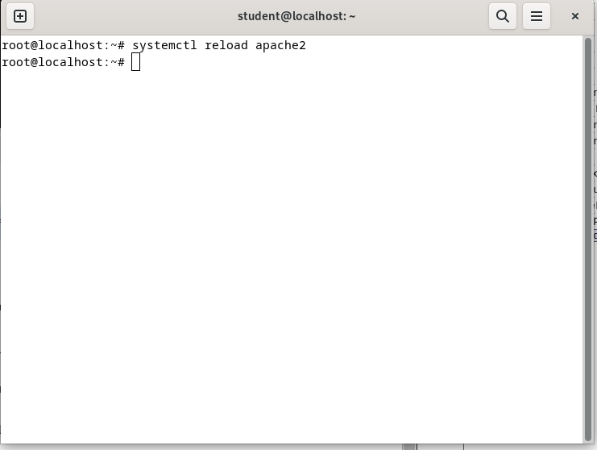

    Jika Konfigurasi sudah di reload dan berhasil, maka bisa di-test dengan browser domain yang sudah dikonfigurasi dari awal tadi

    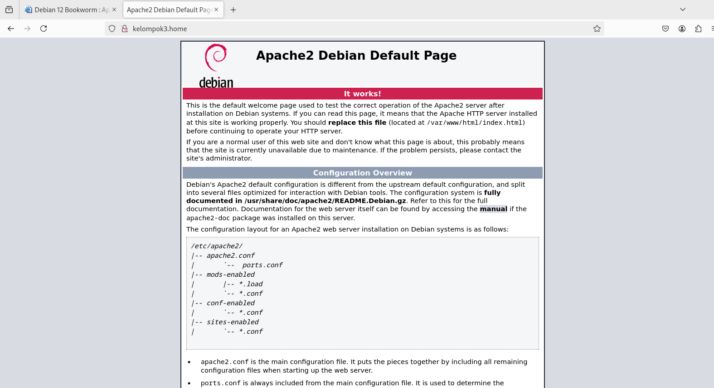